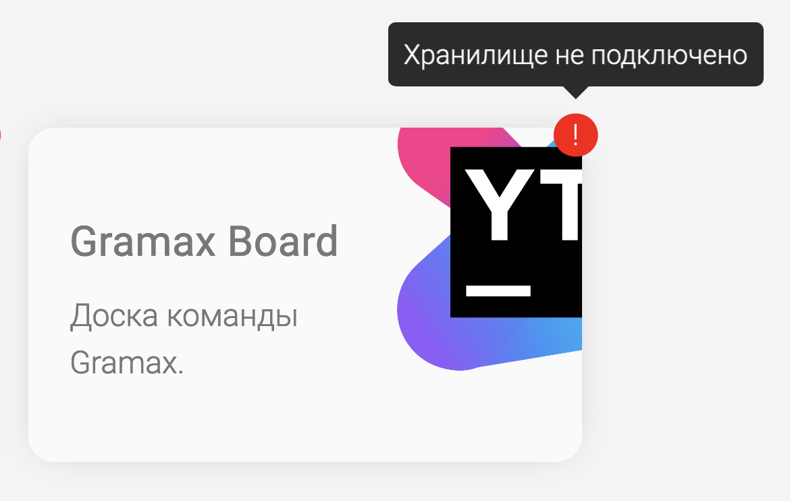
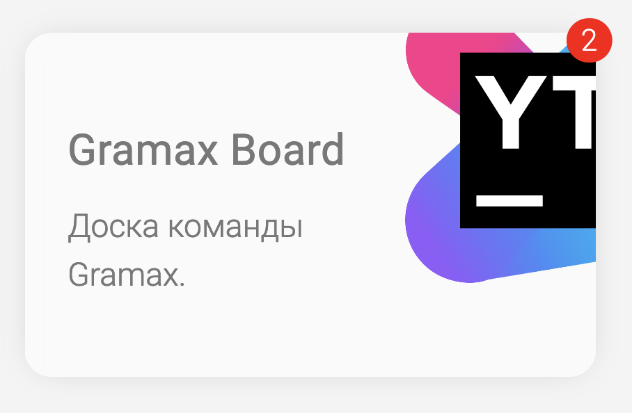
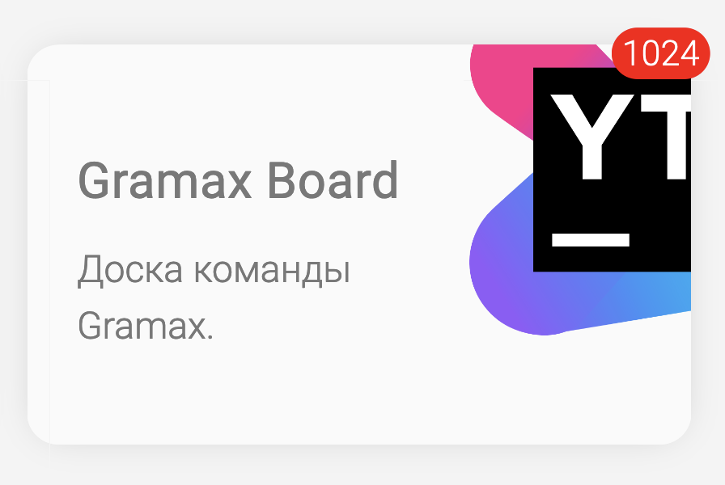
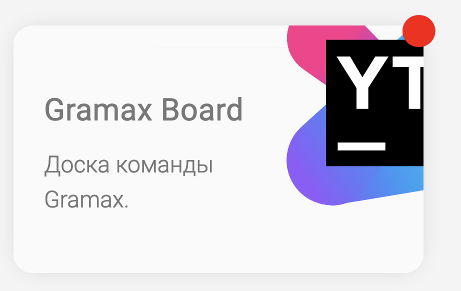
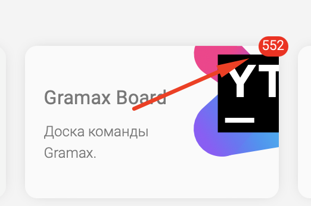
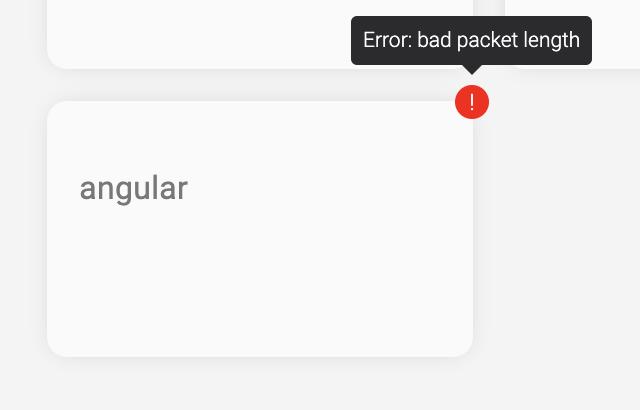

Сейчас на главной странице не отображается, можно ли синхронизировать каталог. Пользователь никогда не узнает, появились ли новые  изменения, пока не посетит их.

Нужно, чтобы пользователь знал, что в его каталогах произошли изменения и он может ли их синхронизировать.

## Критерии

1. Каталоги пользователя автоматически фетчатся раз в 5 минут, пока он находится на главной странице

   1. Не происходит, если у пользователя нет интернета

   2. Не происходит фетча, если пользователь в течении 5 минут вышел и зашёл на главную снова.

      Время последнего фетча сохраняется, как это работает сейчас с автофетчем в каталоге

2. Если каталог можно синхронизировать, в его верхнем углу отображается уведомление в виде красного круга или овала, в зависимости от количества изменений.

   Внутри него содержится количество статей/ресурсов, которые нужно синхронизовать. При наведении на уведомление показывается тултип

   *Тултип*: <количество-файлов> файлов доступны для синхронизации

3. Логика подсчёта изменений в уведомлении и у кнопки синхронизации одинакова

   1. Если среди изменённых файлов нет статей, то уведомление -- пустой красный кружок

      *Тултип*: В репозитории что-то изменилось, но каталог все еще актуален.

   2. В уведомлении отображается количество входящих файлов, а у [comment:1]кнопки синхронизации [/comment]-- входящих и исходящих

   3. За статью/ресурс считается файл, который содержится в корневой директории каталога (свойство “Директория”)

   4. Количество изменений подсчитывается только для активной ветки

4. Если у каталога, который является git-репозиторием, не подключено хранилище, на месте уведомления в красном кружке отображается восклицательный знак

   *Тултип*: Хранилище не подключено

5. Если каталог не является git-репозиторием, уведомление никогда не отображается

## Замечания

-  Изменить цвет на синий?

-  Количество входящих файлов в красном кружке не по центру.

-  Думаю тут должен быть всегда понятный пользователю текст, сейчас непонятный

   
