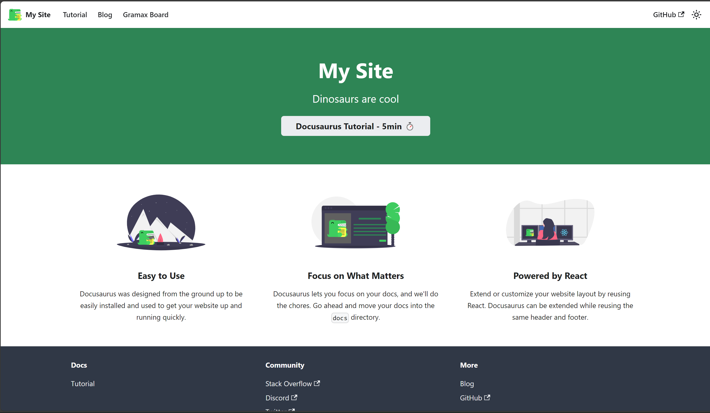
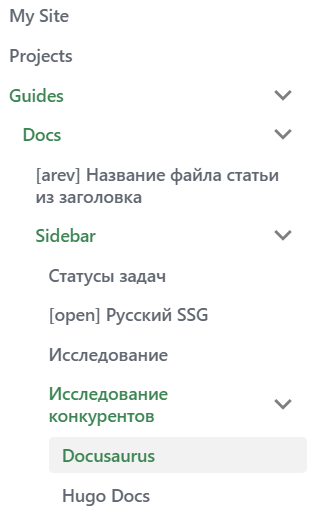
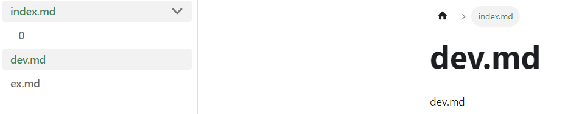

### Первый взгляд



Сайт **Docusaurus** состоит из следующих компонентов:

1. Главная страница: исходники находятся  в файле `src/pages/index.js`.

2. Панель навигации: исходники -- в файле `docusaurus.config.js` и определяется в разделе `themeConfig.navbar` на сайте располагается в верхней части главной страницы.

3. Страницы: обычно создаются с использованием [плагинов](https://docusaurus.io/docs/api/plugins#content-plugins).

4. Подвал сайта: обычно настраивается в файле `docusaurus.config.js` и определяется в разделе `themeConfig.footer`.

Плагины для создания страниц:

1. **plugin-content-docs**: Этот плагин предназначен для управления документацией на сайте. Он позволяет создавать структурированную документацию с помощью Markdown файлов и автоматически генерировать навигацию, содержание, и сайдбары на основе этих файлов.

2. **plugin-content-blog**: Этот плагин предназначен для добавления блога на ваш сайт.

3. **plugin-content-pages**: Этот плагин позволяет создавать одноразовые автономные страницы.

### Инициализация проекта

1. Для того чтобы создать проект нужны **Node.Js** и его инструменты:

   -  **npm** (Node Package Manager)

   -  **npx** (Node Package Execute)

   или **Yarn**

2. В командной строке выполнением команды

   -  С использованием **npx** (рекомендуется для npm 5.2.0 и выше):

      `npx/yarn create-docusaurus@latest my-docusaurus-site`

   -  С использованием **Yarn**:

      `yarn create docusaurus my-docusaurus-site classic`

   в папке `my-docusaurus-site` создаётся проект **Docusaurus**

### **Режим разработки**

Для работы над сайтом и внесения изменений в реальном времени используйте команду:

`npm start`

или, если вы используете Yarn:

`yarn start`

Эта команда запускает локальный сервер разработки и автоматически перезагружает ваш сайт в браузере при каждом изменении файлов проекта

### **Запуск сборки**

Для запуска сборки, просто выполните в терминале:

`npm run build`

или, если вы используете Yarn:

`yarn build`

После успешной сборки в директории `build` вашего проекта появятся статические файлы, готовые к развертыванию.

### Добавление страниц

Чтобы добавить новый раздел (структурированная группа страниц) с документацией надо:

-  Способ 1:

1. Создать каталог для нового раздела. Например, создать каталог `новый-раздел`.

2. Для добавления подразделов в новый раздел, надо создать подкаталоги для них внутри каталога нового раздела.

3. В созданном каталоге и подкаталогах можно срздать файлы `index.md`. Эти файлы будет служить главной страницей нового раздела и подразделов соответственно.

   Главная страница у каталога будет отображаться отдельным элементом в боковой панели. Чтобы она была первой в списке можно указать позицию элемента  с помощью метаданных YAML в начале файла

   ```
   sidebar_position: 1
   ```

4. В файле конфигурации `docusaurus.config.js` надо указать плагин `content-docs` для нового раздела и параметры: id, путь к каталогу нового раздела и префикс URL  для него.

   ```
   const config = {
     ...
     plugins: [
       [
         'content-docs',
         {
           id: 'новый-раздел', // Уникальный идентификатор раздела
           path: 'новый-раздел', // Путь к каталогу с содержимым раздела
           routeBasePath: 'новый-раздел', // Префикс URL для раздела
         },
       ],
     ],
     ...
   };
   ```

5. В этом же файле добавить новый пункт меню с ссылкой «/новый-раздел» и названием «Новый раздел», расположенный слева в навигационной панели:

   ```
   const config = {
     ...
     themeConfig: {
       ...
       navbar: {
         ...
         items: [
           ...
           { to: 'новый-раздел', label: 'Новый раздел', position: 'left' },
         ],
       },
     },
     ...
   };
   ;
   ```

-  Способ 2:

   Файлы из которых будет создан раздел должны быть в папке `docs`

   1. В файле `sidebars.js` определить структуру раздела

      Если использовать автоматическую генерацию, тогда иерархия списка на сайте будет такой же как и в исходной папке, например в `docs/новый-раздел`

      ```
      const sidebars = {
        ...
        новый_раздел: [
          {
            type: "autogenerated",
            dirName: "новый-раздел",
          },
        ],
        ...
      };
      ```

      Но также можно самому определить иерархию списка

      ```
      новый_раздел: [
        "gramax-board/index",
        "gramax-board/projects/index",
        {
          type: "category",
          label: "Guides",
          link: {
            type: "generated-index",
            title: "Docusaurus Guides",
            description:
              "Let's learn about the most important Docusaurus concepts!",
            keywords: ["guides"],
            image: "gramax-board/logo.svg",
          },
          items: [
            {
              type: "category",
              label: "Docs",
              link: {
                type: "doc",
                id: "gramax-board/next-release/history",
              },
              items: [
                "gramax-board/next-release/url",
                {
                  type: "category",
                  label: "Sidebar",
                  items: [
                    "gramax-board/new_article_0/state",
                  ],
                },
              ],
            },
          ],
        },
      ],
      ```

      Получившийся список:

      

   2. В  файле конфигурации `docusaurus.config.js` добавить новый пункт меню с указанием на sidebarId «новый-раздел» и названием «Новый раздел», расположенный слева в навигационной панели:

      ```
      const config = {
        ...
        themeConfig: {
          ...
          navbar: {
            ...
            items: [
              ...
              {
                type: 'docSidebar',
                sidebarId: 'новый_раздел',
                position: 'left',
                label: 'Новый раздел',
              },
            ],
          },
        },
        ...
      };
      ;
      ```

      Раздел будет располагаться по пути `/docs/новый-раздел`

Если есть файл с именем [dev.md](http://dev.md) и папка dev с файлом [index.md](http://index.md)

```
| - dev.md
| _ dev/
   | - index.md
```

так как все только один из трёх файлов должны имееть url `./dev`, то отобразиться `dev.md`, хотя визуально на сайте `index.md` доступно, но при нажатии на него кидает на `dev.md` (как в gramax)



### Особенности

**Docusaurus** читает **md** файлы как **mdx** (расширение **Markdown** для JSX), поэтому выдает ошибки при неправильном синтаксисе

Например

-  Простые ссылки

   Gramax оборачивает ссылки в `<>` из-за этого **docusaurus** выбивает ошибку.

   Решение:

   удалить символы `<>`

-  Ссылки типа `[текст ссылки](url)`

   Если `url` пустой, то **docusaurus** выбивает ошибку

   Решение:

   Обозначить его как `/` -- в Markdown синтаксис `[текст ссылки]()` ~~эквивалентен~~ `[текст ссылки](/)`

-  Фигурные скобки

   Если фигурные скобки испольщуются как текстовые символы **docusaurus** выбивает ошибку

   Решение:

   экранировать скобки: {несколько слов текста} => \\{несколько слов текста\\}