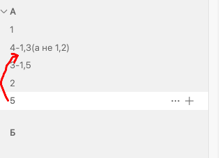
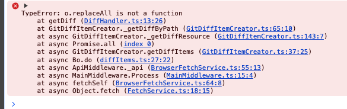
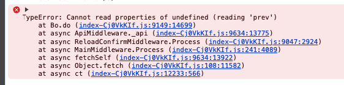

На данный момент, при изменении порядка статьи, изменяется порядок и других статей в  разделе, что сбивает с толку пользователя при просмотре изменений в окне публикации.

Не должно происходить изменения порядка других статей (свойство `order`) в разделе, когда перетащили, удалили или добавили одну из них. То есть изменённый статьей должна остаться та, чей порядок изменили. Важно чтобы [число](), обозначающее порядок, было максимально компактным.

## Критерии

-  При перетаскивании или создании (равнозначно) статьи, её порядок (свойство `order`) меняется по правилам:

   -  При перетаскивании, в качестве порядка статье задаётся среднее значение порядка между двумя её соседями по формуле `(A + B) / 2`.

      -  Пример: Статья A имеет порядок 1, B - 2. При вставке статьи между ними, новая статья будет иметь порядок: `(1 + 2) / 2 = 1.5`

   -  Порядок пытается округлиться до ближайшего (большего, затем меньшего) значения в том же разряде. Если такое значение уже занято, то используется неокруглённое.

      -  Пример: При попытке создать статью между A c порядком 1 и B с порядком 1.5, новая статья будет иметь порядок: `(1 + 1.5) / 2 = 1.25` \~ `1.3`

      -  Пример: При попытке вставки между `1.2` и `1.5` результат без округления - `1.35`, но с округлением он сначала пытается стать `1.3` или `1.4`.  Если статьи с такими порядками уже есть, то остаётся `1.35`

   -  При перетаскивании статьи в начало раздела, когда необходимо вычислить порядок между 0 и N, порядок статьи стремится к 0, но не достигает его.

      -  Пример: `0.5`, `0.2`, `0.1`, `0.05`, так далее.

   -  При создании статьи в конце раздела, её порядок равен порядку последней статьи + 1.

      -  Пример: Если последняя статья имеет порядок `12`, то новая будет иметь `13`.

-  Новая логика определения порядка статей не изменяет порядок уже созданных статей.

-  При достижения ограничения в 6 цифр после запятой хотя бы у одной статьи (см. точность float ниже), порядок статей нормализуется. Порядок в разделе сбрасывается для всех статей -- убираются все числа после запятой, а статьи следуют как: `1, 2, 3`.

   В этом случае пользователь видит в окне публикации, что во многих статьях раздела изменился порядок.

## Оценка

-  Затраты на анализ -- 8ч

-  Реализация -- 12ч

## Технические детали

### Точность Float

При вычислении `order` можно быстро наткнуться на число `1.4 - 0.4 = 0.(9)`.

Для того, чтобы этого избежать, числа сравниваются неточно, epsilon = `10^-10`, а так же результаты ограничены количеством знаков после запятой -- остальная часть округляется.

### Скорость увеличения количества цифр

Отображается, как: `<итерация>) <было> > <стало> (digits: <кол-во цифр после зап.>)`

При наивном решении `(prev + next) / 2`:

```
1) 1 > 0.5 (digits: 1)
2) 0.5 > 0.25 (digits: 2)
3) 0.25 > 0.125 (digits: 3)
4) 0.125 > 0.0625 (digits: 4)
5) 0.0625 > 0.03125 (digits: 5)
6) 0.03125 > 0.015625 (digits: 6)
7) 0.015625 > 0.0078125 (digits: 7)
8) 0.0078125 > 0.00390625 (digits: 8)
9) 0.00390625 > 0.001953125 (digits: 9)
10) 0.001953125 > 0.0009765625 (digits: 10)
11) 0.0009765625 > 0.00048828125 (digits: 11)
12) 0.00048828125 > 0.000244140625 (digits: 12)
13) 0.000244140625 > 0.0001220703125 (digits: 13)
14) 0.0001220703125 > 0.00006103515625 (digits: 14)
15) 0.00006103515625 > 0.000030517578125 (digits: 15)
16) 0.000030517578125 > 0.0000152587890625 (digits: 16)
```

При округлении:

```
1) 0 > 1 (digits: 0)
2) 1 > 0.5 (digits: 1)
3) 0.5 > 0.2 (digits: 1)
4) 0.2 > 0.1 (digits: 1)
5) 0.1 > 0.05 (digits: 2)
6) 0.05 > 0.02 (digits: 2)
7) 0.02 > 0.01 (digits: 2)
8) 0.01 > 0.005 (digits: 3)
9) 0.005 > 0.002 (digits: 3)
10) 0.002 > 0.001 (digits: 3)
11) 0.001 > 0.0005 (digits: 4)
12) 0.0005 > 0.0002 (digits: 4)
13) 0.0002 > 0.0001 (digits: 4)
14) 0.0001 > 0.00005 (digits: 5)
15) 0.00005 > 0.00002 (digits: 5)
16) 0.00002 > 0.00001 (digits: 5)
17) 0.00001 > 0.000005 (digits: 6)
18) 0.000005 > 0.000002 (digits: 6)
19) 0.000002 > 0.000001 (digits: 6)
20) 0.000001 > 5e-7 (digits: 7)
21) 5e-7 > 2e-7 (digits: 7)
22) 2e-7 > 1e-7 (digits: 7)
23) 1e-7 > 5e-8 (digits: 8)
24) 5e-8 > 2e-8 (digits: 8)
25) 2e-8 > 1e-8 (digits: 8)
26) 1e-8 > 5e-9 (digits: 9)
27) 5e-9 > 2e-9 (digits: 9)
28) 2e-9 > 1e-9 (digits: 9)
29) 1e-9 > 5e-10 (digits: 10)
30) 5e-10 > 2e-10 (digits: 10)
31) 2e-10 > 1e-10 (digits: 10)
32) 1e-10 > 5e-11 (digits: 11)
33) 5e-11 > 2.5e-11 (digits: 12)
34) 2.5e-11 > 1.25e-11 (digits: 13)
35) 1.25e-11 > 6.25e-12 (digits: 14)
36) 6.25e-12 > 3.125e-12 (digits: 15)
37) 3.125e-12 > 1.5625e-12 (digits: 16)
38) 1.5625e-12 > 7.8125e-13 (digits: 17)
```

## Замечания

-  \[x\]При перетаскивании статьи 5 между 4 и 3 появилась  ошибка o.replaceAll is not a function. Не всегда воспроизводится.

   



-  \[x\]При публикаци[и перенесенных ст]()атей [появилась]() ошибка. Не всегда воспроизводится.

   

-  \[x\]При перетаскивании отдельных статей Б и В в начало раздела А порядок статей Б и В становится одинаково 0, 5. подробнее в видео

   [video:https://drive.google.com/file/d/19WeMwMikpDXJdeSaAwBmL2x255SvJT9M/view?usp=sharing:]