Для первого этапа нам достаточно переносить только базовые элементы, которые есть в Gramax. На следующих этапах добавим перенос сложных элементов, специальный контрол для неподдерживаемых, информационное окно после переноса и проверку на ошибки.

## Критерии приемки

1. При импорте переносится весь текст и файлы, которые содержатся в статье и поддерживаются в Gramax (см. Поддерживаемые элементы).

2. Если контрол не входит в список поддерживаемых элементов, вместо него вставляется заметка.

:::note:true Не удалось импортировать «Элемент» из Confluence

Вы можете перенести его вручную со страницы [https://baranka144.atlassian.net/wiki/spaces/\~71202020c2e56bb5c14d0bbc06a0a651f2615e/pages/65540](https://baranka144.atlassian.net/wiki/spaces/%7E71202020c2e56bb5c14d0bbc06a0a651f2615e/pages/65540)

```JSON
   Код элемента
```

:::

:::hotfixes:true Техническая информация - ЗАметка

Сейчас над заметкой вставляется пустая строка (она не совсем пустая, там есть невидимый символ, пустая строка просто бы удалилась).\
У нас есть баг, если в таблице над заметкой нет ничего, кроме пустой строки, это ломает страницу

Неподдерживаемые инлайновые элементы будут ломать заметку об ошибке импорта

:::

## Поддерживаемые элементы



---

*  

   В Confluence

*  

   В Gramax

---

*  

   Стили текста

   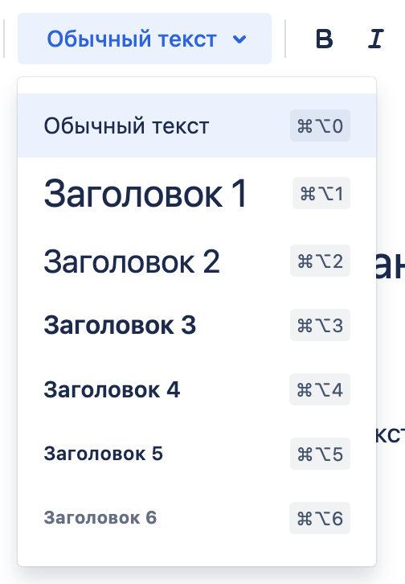

*  

   Стили текста:

   -  Обычный текст

   -  Н1 -> Н2

   -  Н2 -> Н3

   -  Н3 -> Н4

   -  Н4 -> жирный текст

   -  Н5 -> жирный текст

   -  Н6 -> жирный текст

---

*  

   Расширенные параметры форматирования

   

*  

   Стили текста:

   -  **Жирный**

   -  *Курсив*

   -  **Подчеркнутый -- просто жирным**

   -  ~~Зачеркнутый~~

   -  `Строка кода`

   -  Обычный текст

   -  Обычный текст

---

*  

   Выравнивание текста

   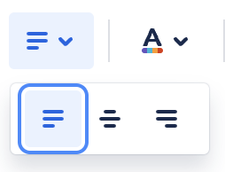

*  

   Обычный текст.

---

*  

   Цвет текста

   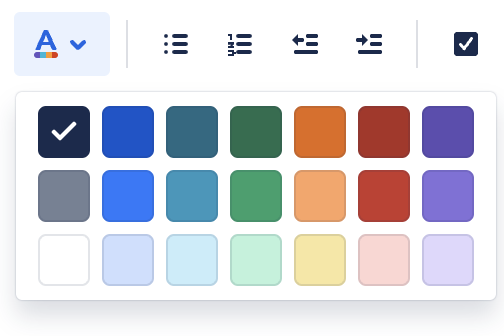

*  

   Цвет текста.

   *Примечание к переносу:*

   *Применять цвет текста из Markdown. Без редактирования текста в панели.*

---

*  

   Списки и отступы

   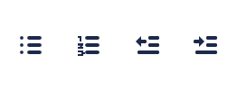

*  

   Списки и отступы:

   -  Маркированный

   -  Нумерованный

   -  Табы

   *Примечание к переносу:*

   *Вложенные списки переводить в наше оформление.*

---

*  

   Задача

   

*  

   Маркированный список.

   *Примечание:*

   Список задач с вложенностью переноситься в следующем виде:

   -  Один

   -  Два

   -   

      -  Три

---

*  

   Ссылка

   

*  

   Ссылка.

   *Примечание к переносу:*

   -  *Ссылки на другие страницы в конфлюенсе переносим ссылками на конфлюенс.*

   -  *Абсолютные ссылки на другие ресурсы просто переносить.*

---

*  

   Изображения, видео, файлы

   

*  

   Изображения, видео, файлы.

   *Примечание к переносу:*

   -  *Изображения -- просто переносим.*

   -  *Видео -- не переносим.*

   -  *Файлы -- просто переносим.*

---

*  

   

*  

   Видео

   *Примечание:*

   Переносятся все “Коннектор виджета”, но не весь контент в них поддерживается

---

*  

   Эмодзи

   

*  

   Эмодзи.

   *Примечание к переносу:*

   Просто переносим, без редактирования в панели.

   *Примечание:*

   При создании страницы с использованием некоторых шаблонов, эмодзи в конфлюенсе могут храниться в таком виде: `\uD83D\uDCD8`

   Переносятся таким же текстом.

---

*  

   Макеты

   

*  

   Переносим в виде таблицы с одной строкой.

   *Примечание:*

   Сохраняем пропорции макета, нужно проверить корректность

   Таблица в макете(У нас будет таблица в таблице) ломает статью

---

*  

   Таблица

   

*  

   Таблица.

   *Примечание к переносу:*

   -  *Переносим таблицы со всем вложенным контентом.*

---

*  

   Фрагмент кода

   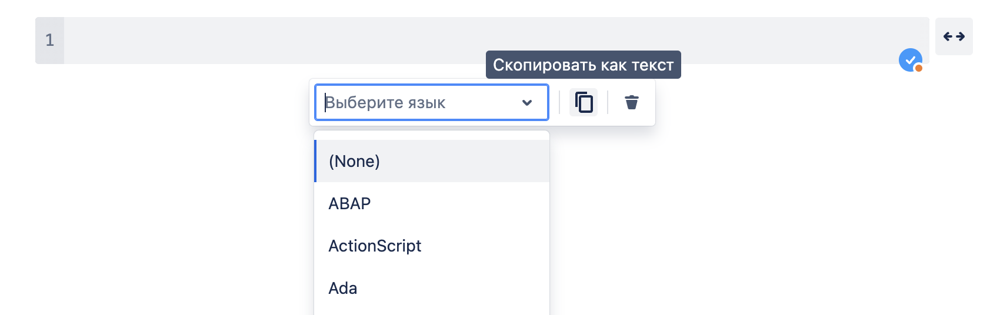

*  

   Блок кода.

   *Примечание к переносу:*

   -  *Переносим название языка для подсветки.*

---

*  

   Информационная панель

   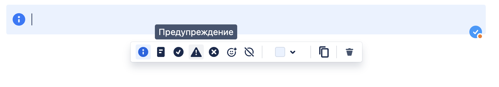

*  

   Заметка.

   *Примечание к переносу:*

   *Сопоставление стиля заметки в конфе и в грамаксе:*

   -  *Информация -- info*

   -  *Примечание -- tip*

   -  *Готово -- lab*

   -  *Предупреждение -- note*

   -  *Ошибка -- danger*

   *Другие примечания:*

   -  *В конфе у заметки можно заменить иконку на эмодзи и поменять цвет фона. Это игнорируем и не переносим.*

---

*  

   Цитировать

   

*  

   Цитата.

---

*  

   Разделитель

   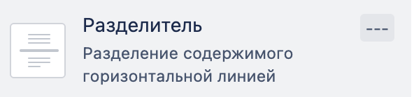

*  

   Линия.

---

*  

   Разворачивание и раскрыть

   

   

*  

   Блок скрытого текста.

---

*  

   Выборка и Вставить фрагмент

   

   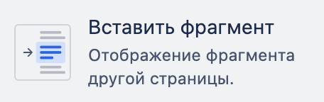

*  

   Переносим просто текстом.

   *Примечание:*

   Места с “Вставить фрагмент” не поддерживаются(

---

*  

   Статус

   

*  

   *Примечание к переносу:*

   *Оформить как инлайновый код.*

   [icon:check]

---

*  

   Дата из календаря

   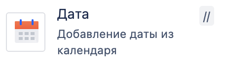

*  

   *Примечание к переносу:*

   *Прописать датой.*

   [icon:check]



## Замечания

-  У таблицы не переносится первый столбец.

   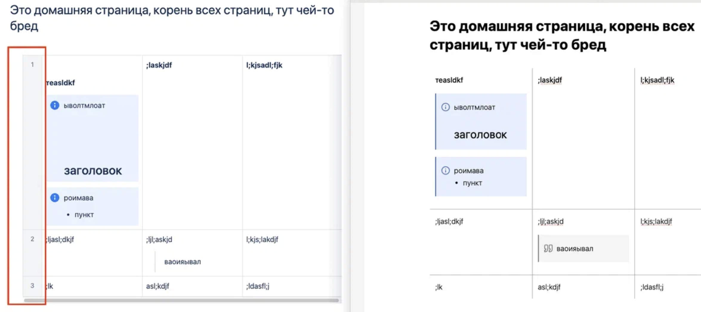

-  Нумерованный список неправильный.

   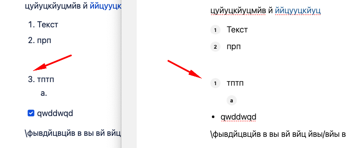

   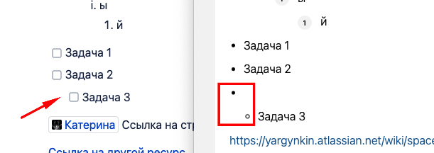

-   
