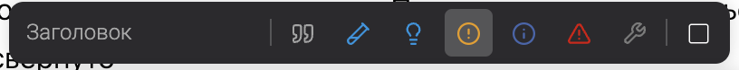
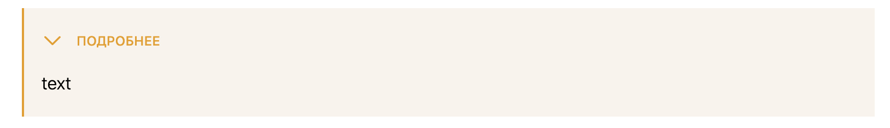
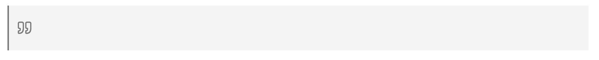
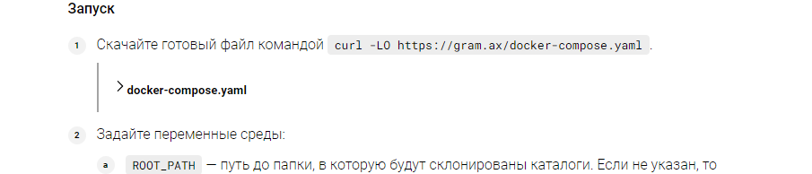
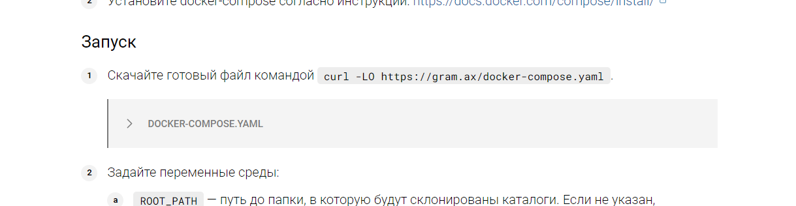

Сейчас в приложении есть 3 похожих блока по смыслу и виду: заметка, катблок, цитата. Хотелось бы объединить их в один блок.

## Критерии

-  Изменена логика работы заметки:

   -  добавлена возможность скрытия тела заметки, и новый тип заметки `quote`.

      

   -  кнопка [icon:square] имеет два состояния. При наведении выводиться тултип “Сворачивать“.

      -  [icon:square] -- заметка не скрываемая. Ставится по умолчанию.  Если нажать на эту иконку, когда у заметки нет заголовка, автоматом проставляется заголовок *Подробнее* и кнопка перейдет в состояние [icon:square-check]

      -  [icon:square-check] -- заметка с возможностью скрытия тела. Если иконка стоит в состоянии [icon:square-check] и с типом `note`, иконка [icon:circle-alert:#eb9c00] заменяется на [icon:chevron-down:#eb9c00] или [icon:chevron-right:#eb9c00], в зависимости от скрытия и раскрытия блока

         

   -  заметка будет хранится в новом формате

      -  Если указано что заметка скрываемая

         ```
         :::note:true title 
         
         text 
         
         :::
         ```

      -  Вид по умолчанию не поменяется

         ```
         :::note title 
         
         text 
         
         :::
         ```

   -  тип `quote` будет выглядеть вот так:

      

-  Изменена логика работы цитаты:

   -  расширение удалено, все прошлые цитаты будут преобразованы в заметки с типом цитата

   -  хоткей создания цитаты (`>` + `space`) будет создавать заметку с типом `quote`

-  Изменена логика работы  кат-блок:

   -  расширение удалено, все прошлые кат-блоки будут преобразованы в заметки с типом `hotfixes` и в скрытом виде

-  Инлайновый-кат останется без изменений (хотелось бы конечно удалить насовсем)

-  Кат блоки в ошибках, заменены на note:

## Исходные заявки

<https://support.ics-it.ru/issue/GXS-1174>


## Замечания

в докпортале остался cut:




