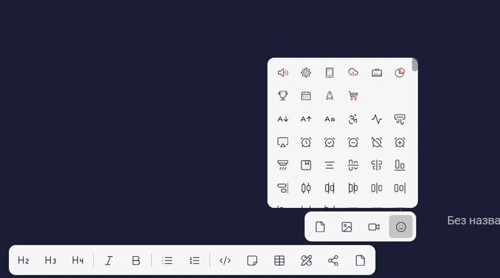
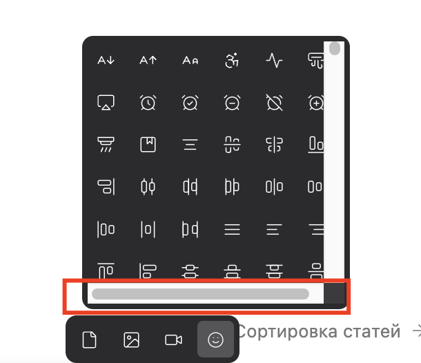
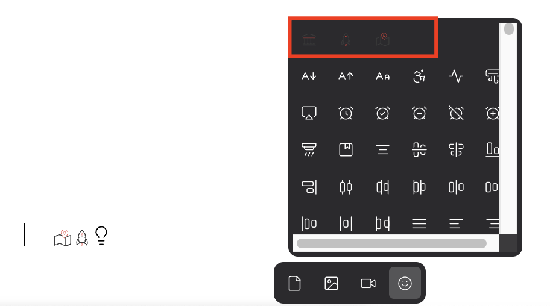

Сейчас, добавить иконку в статью можно только отредактировав markdown. Поэтому нужна возможность добавлять иконки при помощи интерфейса

## Критерии

-  В тулбаре есть кнопка c иконкой [icon:smile] и тултипом “Иконка“. Она находится только в нижней панели в группе файлов справа от видео.

-  При наведении на кнопку открывается окно выбора иконки. Сначала отображаются кастомные иконки из директории `.icons` , затем с новой строки системные.

   

-  При клике по иконке в списке, она вставляется в статью.

-  На иконке в тексте статьи можно сфокусироваться. При фокусе:

   -  Иконка обводится стандартной синей рамкой.

-  Икон file в основной панели заменить на file-video

**Что планируется добавить позже**

-  Возможность менять цвет иконок.

-  Поиск по иконкам.

## Замечания

-  Появляется нижний скролл, на маке.

   

   исправиться в рамках [Поиск в окне выбора иконки](./../../may-2024/vg-ep-a-poisk-v-okne-vybora-ikonki.md)

-  [comment:1]Окно выбора иконки открывается сразу при наведении, а не при клике по кнопке.[/comment]

-  [comment:2]У кнопки c иконкой нет тултипа “Иконка“.[/comment]

-  Кастомные иконки в темной форме плохо видны.

   

   исправлено (кроме случаев, когда цвет задается в коде самой svg)