Сейчас мы можем выгружать в DOCX  элементы, но без стилей. Нужно выгружать из них контент так, чтобы он был похож на исходную статью, но в стилях DOCX.

[zagolovok-2-zagolovok-3-zagolovok-4.docx](./zagolovok-2-zagolovok-3-zagolovok-4.docx)

## Критерии

-  Любой текст, экспортируемой статьи, стилизован с помощью стилей, которые находятся в галерее стилей.

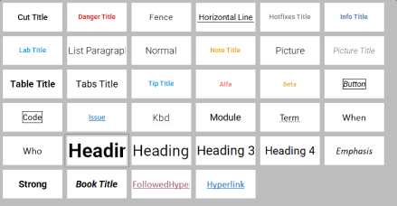

-  Стилизация блоков `заметка`, `цитата`, `блок кода,` `блоки скрытого текста`, `вкладки` выполнены через стили из дизайн-таблицы:

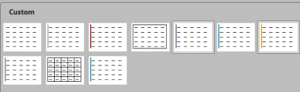

-  Для нумерованных и маркированных списков не применяются никакие общие стили. Все остается как было.

-  Если при экспорте статьи, есть фрагменты, которые мы не умеем экспортировать (`функциональные блоки`, `формулы`, `OpenAPI`, `Ссылка См.`, `группы картинок`), то выдается окно предупреждения:

   -  *Заголовок*: (!) Неподдерживаемые элементы

   -  *Текст*: Экспорт в DOCX не поддерживает следующие специальные элементы Gramax:

      -  Формула

      -  Описание OpenAPI

      -  Функциональный блок

      -  Группа картинок

      Файл сохранится без них.

   -  *Кнопки*:

      -  `Продолжить` -- экспортируется файл без неподдерживаемых элементов.

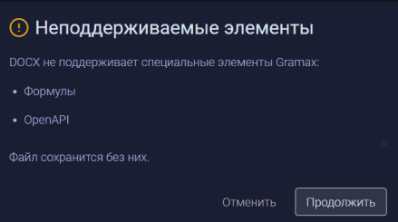

-  Весь документ имеет дефолтные поля (отступы от края страницы)

-  Внешний вид элементов соответствует указанным ниже

### Внешний вид элементов

#### Простые элементы



---

*  

   Вид в приложении

*  

   Вид в word

---

*  

   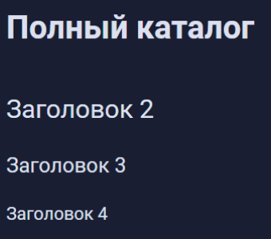

*  

   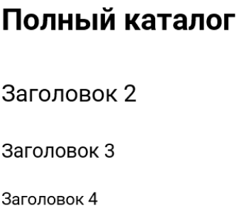

---

*  

   

*  

   

---

*  

   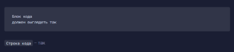

*  

   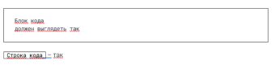

---

*  

   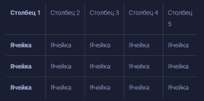

*  

   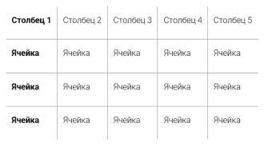

---

*  

   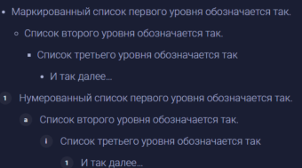

*  

   

---

*  

   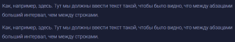

*  

   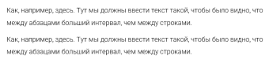

---

*  

   

*  

   



#### Блочные элементы, диаграммы и картинки



---

*  

   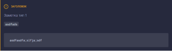

*  

   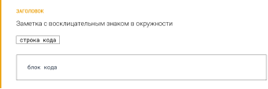

---

*  

   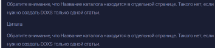

*  

   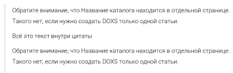

---

*  

   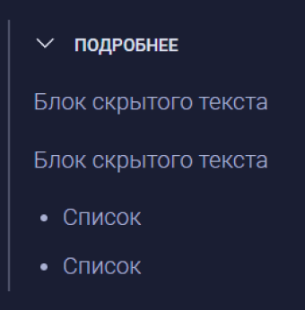

*  

   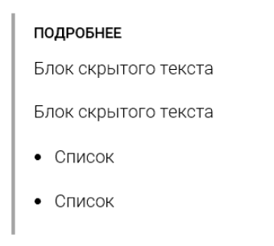

---

*  

   

*  

   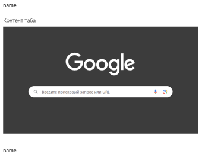

---

*  

   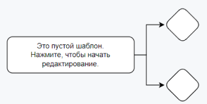

*  

   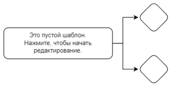

---

*  

   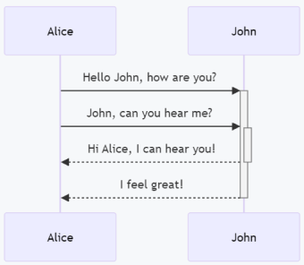

*  

   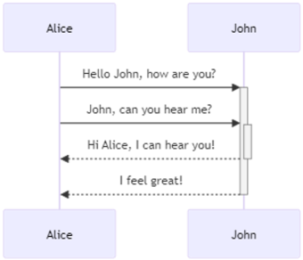

---

*  

   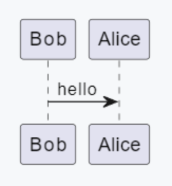

*  

   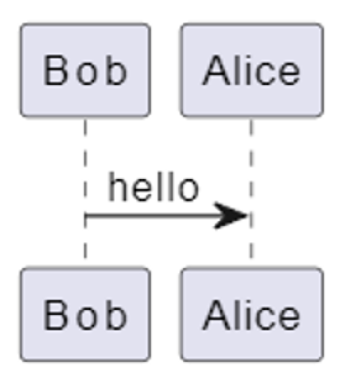

---

*  

   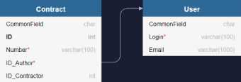

*  

   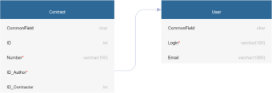

---

*  

   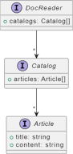

*  

   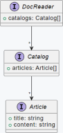

---

*  

   

*  

   

---

*  

   

*  

   

---

*  

   

*  

   

---

*  

   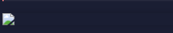

*  

   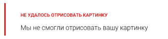



#### Элементы, создаваемые только через Markdown



---

*  

   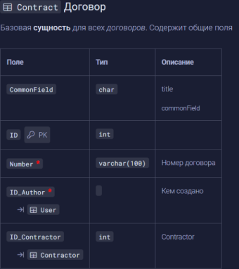

*  

   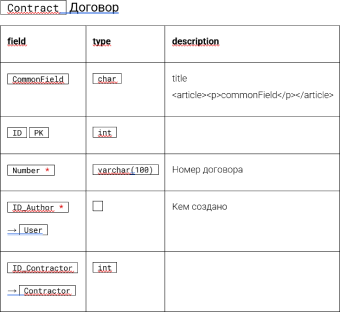

   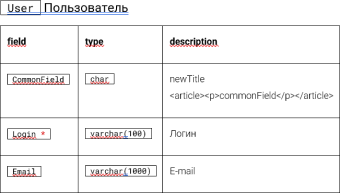

---

*  

   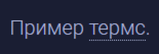

*  

   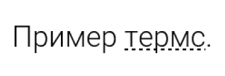

---

*  

   

*  

   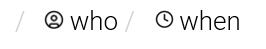

---

*  

   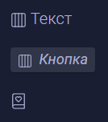

*  

   

---

*  

   

*  

   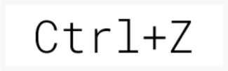

---

*  

   

*  

   

---

*  

   

*  

   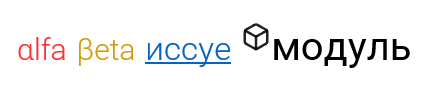

---

*  

   

*  

   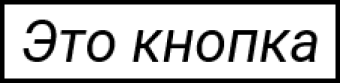



#### Экспортируются с ограничениями:



---

*  

   

*  

   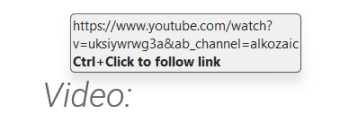

---

*  

*  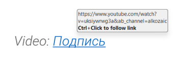

---

*  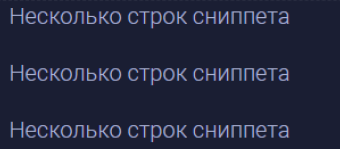

*  

   ***Сниппеты*** -- экспортируются как

   **обычный текст**. Не баг, а фича: чтобы

   сниппеты индексировались,

   нужно обновлять страницу.

---

*  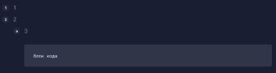

*  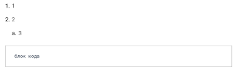

---

*  

*  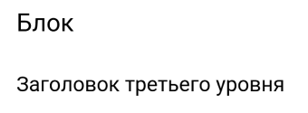

---

*  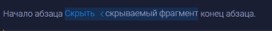

*  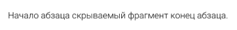

---

*  

*  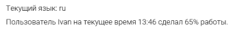



## Технические детали

-  Создается xml аналогично этой документации: <https://docx.js.org/#/usage/styling-with-xml>. Это позволит отображать их в `галерее стилей`

-  Там будут храниться все шрифты и отступы и стили таблиц

-  Если надо поменять или добавить стили:

   1. Экспортируем файл в DOCX

   2. Делаем стили, изменяем стили так, как нужно

   3. дальше всё по инструкции: <https://docx.js.org/#/usage/styling-with-xml>