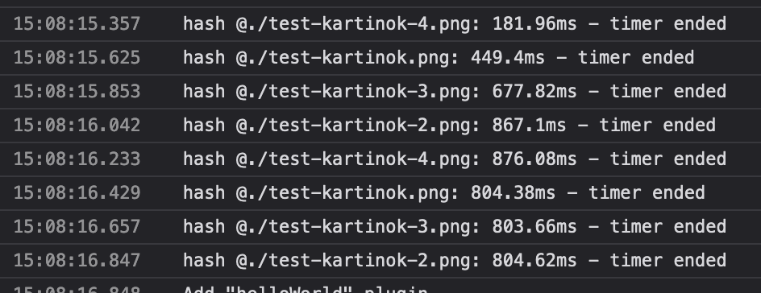
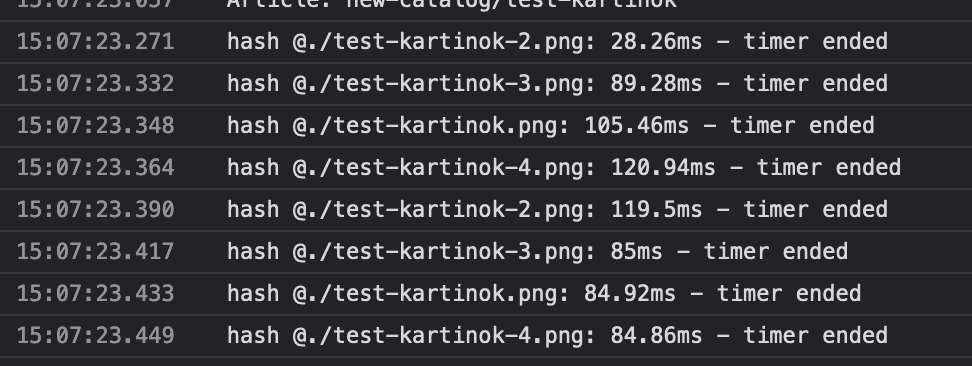

Сейчас картинки/файлы в редакторе читаются и записываются неоптимальным путём. Поэтому тяжёлые картинки и гифки заметно тормозят, а файлы в приложении долго скачиваются. Нужно, чтобы картинки/файлы загружались быстро.

## Критерии

-  Десктопное и браузерное приложение работает быстрее и не зависает намертво при вставке больших картинок или файлов, ограничения на размер в десктопе нет.

-  Максимальный размер вставляемого файла в браузере ограничен в 500мб.

   -  Если пользователь пытается вставить файл размером больше, то выводиться окно ошибки:

      -  Заголовком: Не удалось добавить файл

      -  Текстом: Размер файла превышает 500 МБ. Сожмите его, выберите файл поменьше или воспользуйтесь десктопной версией.

      -  Кнопкой: Понятно

## Сравнение производительности

### Браузер



---

*  

   

*  

   Было (ms)

*  

   Стало (ms)

---

*  

   Вставка скриншота экрана `<1mb`

*  

   `50`\-`60`

*  

   `3`\-`10`

---

*  

   Вставка картинки `1mb`/`13mb`/`100mb`

*  

   `150`/`1200`/`-`

*  

   `37`/`117`/`1600`

---

*  

   Загрузка картинки для отображения

   `1mb`/`13mb`/`100mb`

*  

   `600`/`5200`/`-`

*  

   `60`/`60`/`100`

---

*  

   Вставка файла `1mb`/`50mb`/`100mb`/`150mb`/`500mb`

*  

   `124`/`6000`/`17000`/`-`/`-`

*  

   `42`/`290`/`590`/`900`/`3300`

---

*  

   Скачивание файла `1mb`/`50mb`/`100mb`/`150mb`/`500mb`

*  

   `500`/`30000`/`-`/`-`/`-`

*  

   `20`/`150`/`230`/`350`/`2600`



### Десктоп (релиз билд)



---

*  

   

*  

   Было (ms)

*  

   Стало (ms)

---

*  

   Вставка скриншота экрана `<1mb`

*  

   `~400`

*  

   `1`\-`10`

---

*  

   Вставка картинки `1mb`/`13mb`/`100mb`

*  

   `214`/`2600`/`-`

*  

   `11`/`27`/`250`

---

*  

   Загрузка картинки для отображения

   `1mb`/`13mb`/`100mb`

*  

   `600`/`5200`/`-`

*  

   `60`/`60`/`100`

---

*  

   Вставка файла `1mb`/`50mb`/`100mb`/`150mb`/`500mb`

*  

   `230`/`16000`/`-`/`-`/`-`

*  

   `34`/`130`/`370`/`540`/`2700`

---

*  

   Скачивание файла `1mb`/`50mb`/`100mb`/`150mb`/`500mb`

*  

   `480`/`-`/`-`/`-`/`-`

*  

   `13`/`66`/`176`/`221`/`2600`



## Исходные заявки

-  <https://support.ics-it.ru/issue/GXS-1728>

## Сроки

-  Анализ -- 5ч

-  Реализация -- 8ч

## Замечания

-  Очень долго подключается хранилище и публикуются изменения с большими файлами.

-  \[x\]В браузере при добавлении больших файлов не появляется никакое сообщение с ограничением.

-  \[-\]В браузере большие файлы долго добавляются.

---

## Технические критерии

-  Для отображения картинок используется их URL.

   -  В браузере используется `URL.createObjectUrl` и создаётся из байт картинки

-  В десктопном приложении для чтения и записи файлов используется custom-protocol.

-  Алгоритм хеширования для HashResourceManager заменён с самописного MD5 на xxhash из библиотеке `xxhash-wasm`.

   -  В браузерной и десктопной версии хеширование не используется -- оно там не нужно

## Технические детали

Сейчас в редакторе используется очень наивный способ для отображения картинок. Содержимое картинки (массив байт) кодируется в base64 и задаётся в атрибут `src` у `img`. В браузере это ещё кое-как работает, а десктопу совсем печально.

На скорость чтения/записи ресурсов сильно влияет алгоритм хеширования в HashResourceManager. Сейчас там используется самописный MD5, если заменить его на библиотеку `xxhash-wasm` - будет заметный прирост.

Бенчмарк -- картинки одинаковые

### Реализация

#### Скачивание файлов в приложении

Поведение скачивания файлов останется прежнем, но скорость увеличится за счёт отключения хеширования, а в десктопе -- ещё и за счёт custom protocol.

#### Отображение картинок

Ребята из таури уже задумывались над этим вопросом -- [Github Discussion](https://github.com/tauri-apps/tauri/discussions/7145). После [этой US](https://dev.gram.ax/gitlab.ics-it.ru/dr/gramax-board/master/-/may-2024/stabilizaciya/nv-a-kopirovanie-i-vstavka-uzlov), нам нужно хранить картинки в памяти на фронтенде, поэтому используется `createObjectUrl`.

В браузере использовать `createObjectURL` -- [StackOverflow](https://stackoverflow.com/questions/61302149/why-use-url-createobjecturlblob-instead-of-image-src).

#### Загрузка картинок и файлов

В десктопе реализовать custom protocol для чтения и записи файлов: [github example](https://github.com/tauri-apps/tauri/blob/dev/examples/streaming/main.rs). Мейнтейнеры таури рекомендовали использовать такой подход, если требуется избежать сериализации в json.

Это в целом ускорит работу с файлами в десктопном приложении.

Для сравнения, чтение и запись файла 1gb:

-  При помощи `#[tauri::command]`: вкладка кушает 5gb, она зависла, загрузки я не дождался (>10min).

   

-  При помощи `custom protocol`: 2-4s. Картинки во этом случае загружаются асинхронно, поскольку этим управляет не приложение, а вебвью. Гифка размером 100мб отображается моментально.

В браузере с этим ничего не сделать, поскольку файлы хранятся в OPFS, но изменение алгоритма хеширования улучшит ситуацию.