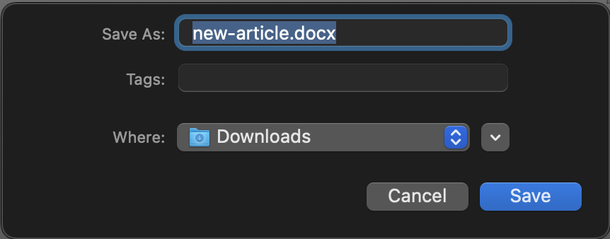
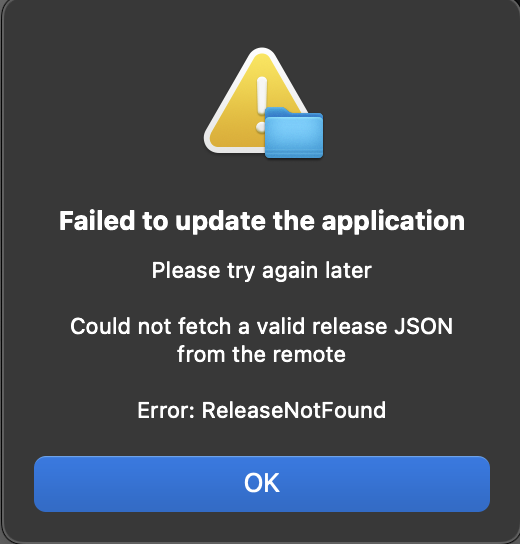
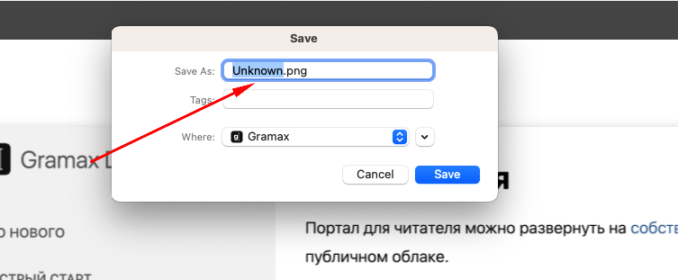
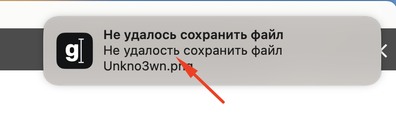
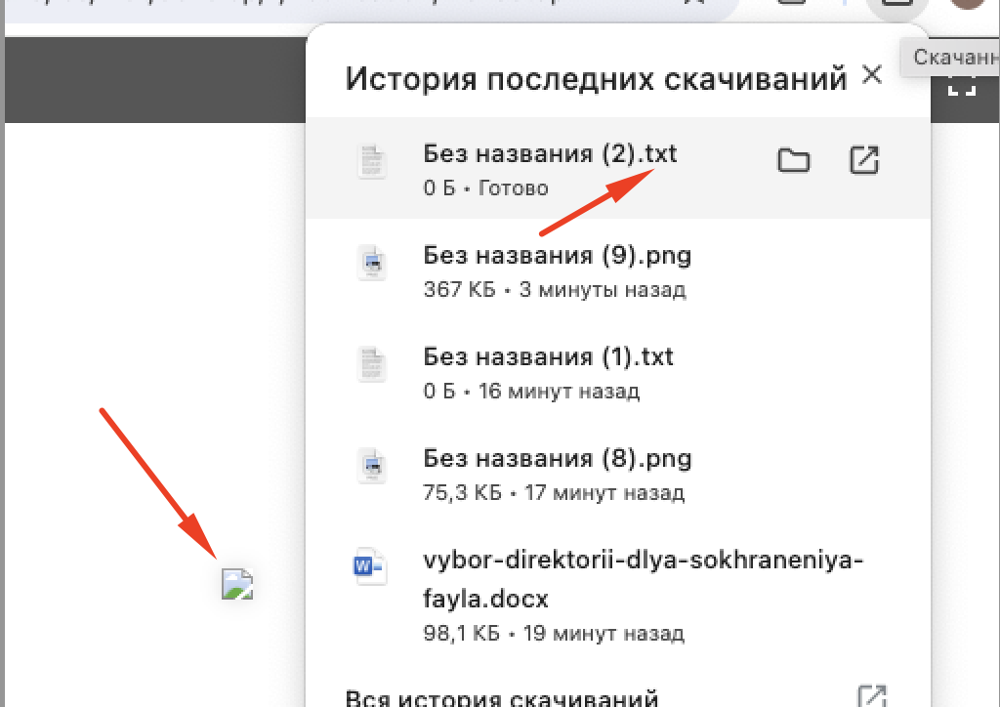

Сейчас, когда пользователь хочет сохранить файл или экспортировать статью в docx в десктопном приложении, оно автоматически использует директорию Downloads и не даёт пользователю выбора. А если у приложения нет прав доступа к папке Downloads, оно выдаёт ошибку.

[comment:1]Нужно, чтобы пользователь мог  выбирать, куда сохранить файл[/comment]. Если для сохранения файла недостаточно прав, пользователь должен знать об этом.

## Критерии

-  При экспорте или сохранении файла, приложение всегда спрашивает пользователя, куда он хочет сохранить файл при помощи стандартного окна выбора папки ОС.

   -  Если пользователь закрыл окно на кнопку Cancel, то отменять скачивание.

      

-  Перед сохранением файла, приложение проверяет, что может записать файл по указанному пути.

   -  Если у приложения недостаточно прав, то оно выдаёт ошибку о невозможности сохранения в виде системного диалогового окна -- как при неудачном обновлении.

      -  *Заголовок*: Не удалось сохранить файл (Failed to save file)

      -  *Тело*: У приложения нет доступа к папке <path>. Выберите другую. (The application does not have access to the <path> folder. Choose another one.)

         

## Оценка

-  Исследование -- 2 часа

-  Анализ -- 1 час

-  Реализация -- 2-3 часа

## Исходные заявки

-  <https://support.ics-it.ru/issue/GXS-1458>

-  <https://support.ics-it.ru/issue/GXS-1458>

## Технические детали

-  Доступ к файлу проверяется попыткой создания пустого файла по заданному пути.

## Замечания

При скачивании картинок:

-  \[x\] Не подтягивается название картинок

-  \[x\] Ошибка в слове “Удалось“. Также информация дублируется

-  \[x\] Битые картинки скачиваются в формате txt

