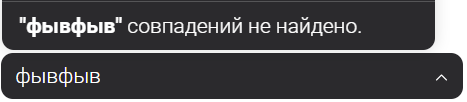
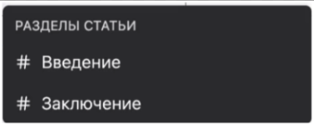
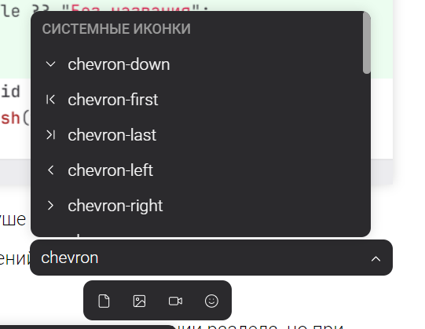
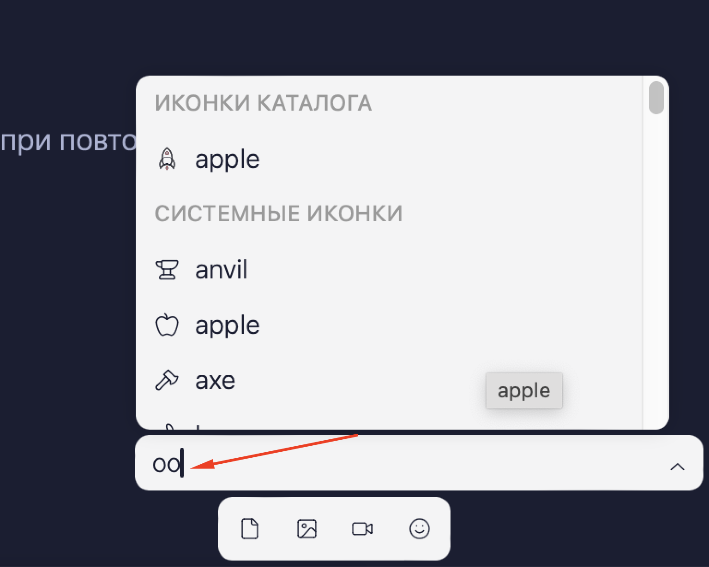
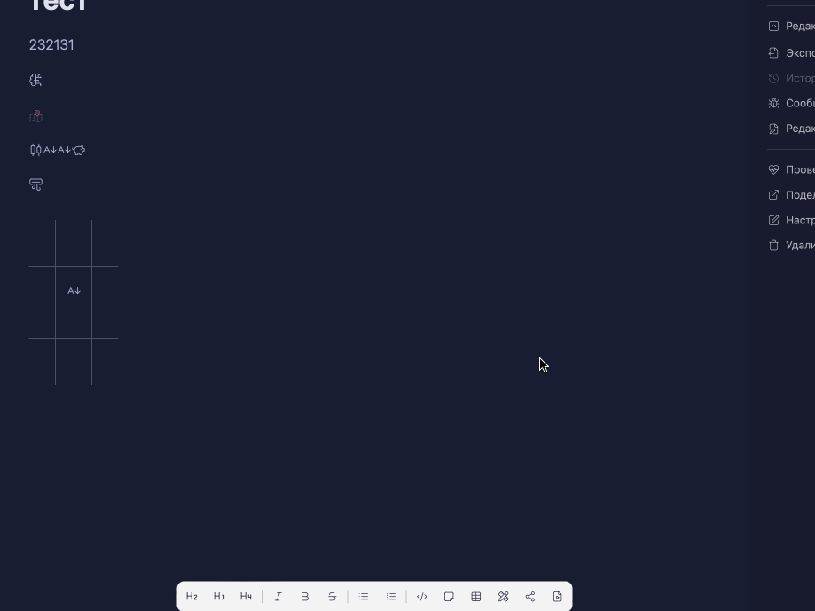

Список иконок доступных для вставки содержит в себе более 1.4k иконок, хотелось бы иметь возможность производить поиск среди иконок, а не искать нужную просто проматывая список

## Критерии

-  При нажатии на кнопку вставки иконки, сверху отображается инпут как в сниппетах. С плейсхолдером "Поиск по английскому коду”. Над инпутом отображаются все иконки. При вводе символов список иконок сверху сразу отфильтровывается.

-  Поиск осуществляется по вхождению подстроки в имя файла иконки, а также для системных по вхождению в имя категорий, в которые они входят

-  Если при поиске не найдено ни одной иконки, то вывести введенную строку в кавычках с [comment:3]надписью[/comment] “совпадений не найдено”

   

-  Группировка иконок: В списке иконок отображаются иконки по группам: сначала “Иконки каталога”, потом “Системные иконки”. Если в результате фильтра в группе не осталось ни одной иконки, эта группа скрывается.

   Компонент группы такой же как и у ссылок на заголовки

## Оценка

-  Анализ -- 4ч

-  Реализация -- 24ч

## **Замечания**

-  Я могу сфокусироваться на “СИСТЕМНЫЕ ИКОНКИ” с помощью строчки вверх. При нажатии на enter ничего не происходит. Нужно, чтобы нельзя было сфокусироваться на этот текст

-  Поиск по запросу “оо“ выдал неправильный результат.

   

   Потому что также сработал поиск по категориям: `apple`  есть в категории `food`, а `anvil` и `axe` в `tools`,

-  При выборе иконок по стрелкам вверх и вниз фокус перемещается не по порядку, прыгает через несколько иконок.

   

-  При нажатии на кнопку окно с иконками закрывается и не появляется при повторном нажатии по кнопке.

   

   работает по тому же принцепу, что и снипеты

-  Инпут с поиском немного уменьшить, не по линии с иконками.

   

   компонент такой же как и у снипетов