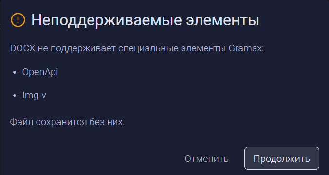
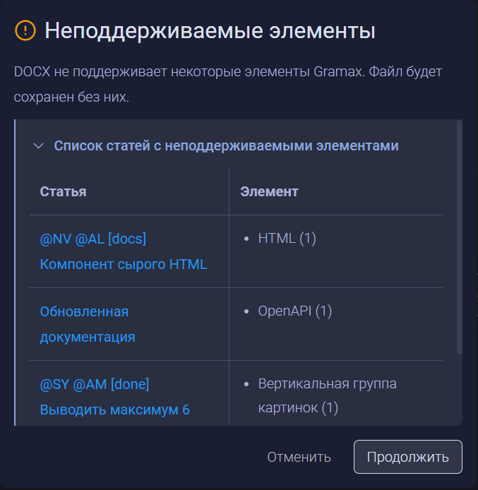
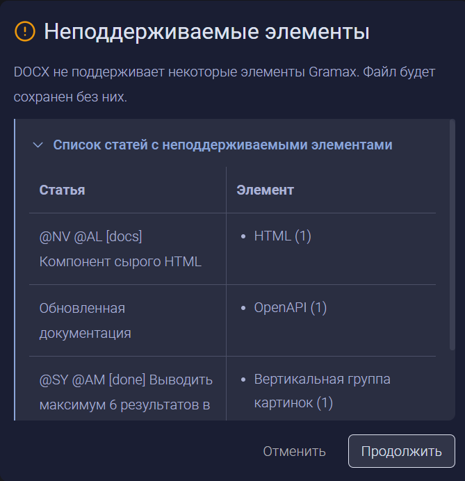

Сейчас при экспорте статей в DOCX, если есть неэкспортируемые элементы, мы получаем малоинформативное предупреждение.

Проблемы:

-  Нет информации, в какой статье находятся эти неэкспортируемые элементы.

Было принято решение сделать список неэкспортируемых элементов, аналогично тому, как они реализованы в импорте из Confluence.

## Критерии

-  При наличии неэкспортируемых элементов выводится стандартное окно, как при импорте из конфлюенс.

-  Можно кликнуть по названию статьи и перейти в нее в новой вкладке.

-  Это окно будет появляться при экспорте статьи/раздела/каталога

## Тесты

-  Юнит-тесты - правильно находит статьи и их неэкспортируемые элементы

## Ограничения

-  В приложении нельзя открыть ссылку в новой вкладке

