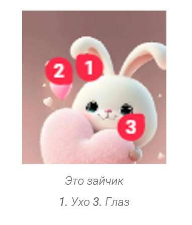

На прошлом POREV были предъявлены некоторые замечания к аннотациям: сейчас текст аннотации подписывается **Аннотации к изображению**, хотелось бы сделать так, чтобы было понятно, что текст в аннотациях относится к картинке без этой подписи. Также хотим сделать текст аннотации в более стандартном виде.

## Критерии

-  Аннотации к изображению имеют такой же стиль как подпись к изображению

-  Аннотации отображаются на отдельной строке друг за другом.

-  Когда нет подписи к изображению, то тут будет только строчка с аннотациями. Когда нет аннотаций, то будет строчка только с подписью.

-  Пример как это должно выглядеть когда есть и подпись и аннотации:

g)
