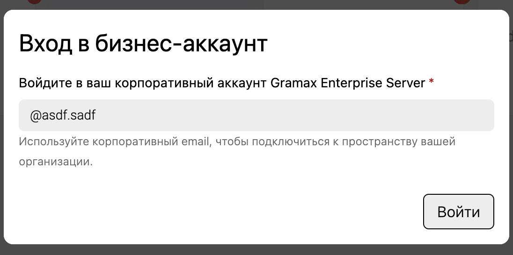
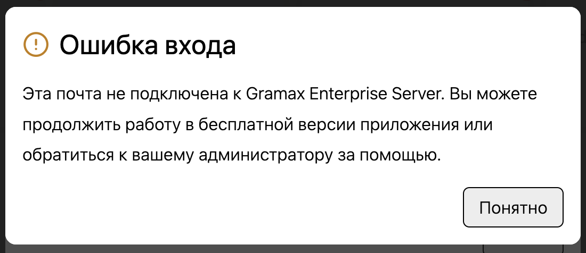

Сейчас не понятно что за кнопка входа в приложении для редактирования. Хотелось бы чтобы она была понтяной.

## Критерии

-  Модальное окно входа

   -  Хэдер: Вход [comment:eumW7]в бизнес-аккаун[/comment]т / Sign in to Your Business Account

   -  Текст: [comment:YvKWF]Войдите в ваш корпоративный аккаунт[/comment] Gramax Enterprise Server. / Sign in to your Gramax Enterprise Server account.

   -  [comment:2yTdh]Плейсхолдер инпута[/comment]: [comment:9UEeN]Введите свою почту[/comment] / Enter your email

   -  Дескрипшен к инпуту: Используйте корпоративный email, чтобы подключиться к пространству вашей организации. / Use your work email to connect to your organization's workspace.

   -  Кнопка: Войти / Sign In

   

-  Окно с ошибкой аутентификации

   -  Хэдер: Ошибка входа / Sign-in Error

   -  Текст: Эта почта не подключена к Gramax Enterprise Server. Вы можете продолжить работу в   бесплатной версии приложения или обратиться к вашему администратору за помощью. / This email isn't set up for Gramax Enterprise Server. You can continue using the full features of the free version or contact your admin for further assistance.

   -  Кнопка: Понятно / [comment:d73zr]Okay[/comment]

      

## Тесты

-  Тестов нет

## Оценка

-  Анализ: 30мин

-  Реализация: 1ч