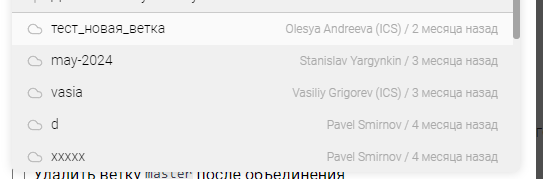

## Проблема

Долго грузится список репозиториев Gitlab. Занимает больше 8 секунд в среднем.

## Критерии приемки

1. Скорость загрузки всех репозиториев в Gitlab уменьшена на \~50%

2. Вместе с название группы и репозитория, в списке отображается дата последнего изменения в репозитории.

   1. Дизайн будет как в списке веток, но только с датой (без автора и иконки):

   

   1. При наведении на дату - показывается тултип с точной датой изменения

   

3. Список веток отфильтрован по дате последнего изменения в репозитории

## Оценка

8 часа

Реальность - 20 часов

## Тесты

Тестить нечего

## Исходные заявки

-  <https://support.ics-it.ru/issue/GXS-1286>