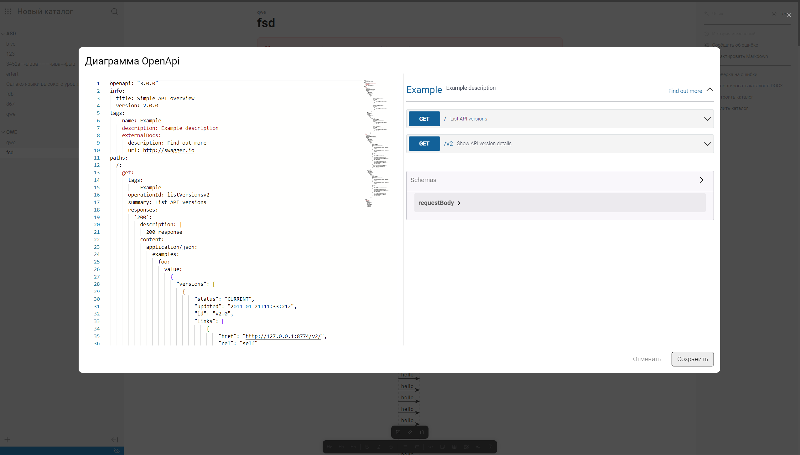

Сейчас диаграммы неудобно редактировать, т.к. не видишь результат, пока не закроешь окно с монако.

### Критерии

-  В окне редактирования диаграммы справа появится сама диаграмма:

   -  для OpenApi, Mermaid и PlantUml;

-  Когда пользователь ввел неправильный синтаксис:

   -  диаграмма становиться серой (взять стили с кнопки);

   -  показывается Alert под кодом.

-  Когда есть изменения и нажав на бекграунд или Esc, тогда покажется уведомление с конфирмом, как при редактировании картинок:

   -  текст в конфирме: `Вы уверены что хотите выйти из режима редактирования?`;

-  По нажатию на кнопку Сохранить, диаграмма обновляется в статье:

   -  можно сохранить с ошибкой в синтаксисе;

:::info:true Пример редактирования диаграммы

:::

### Оценка

-  8-12 ч. ч.