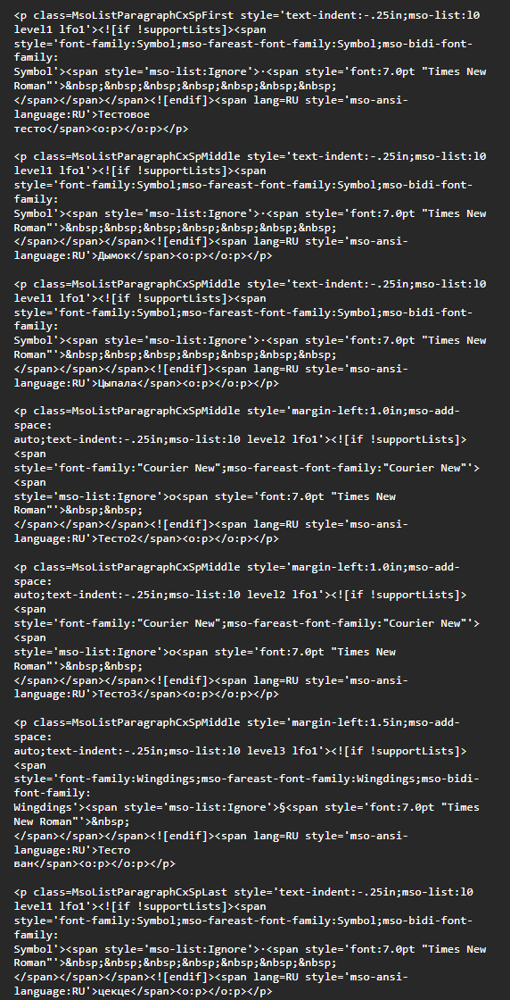
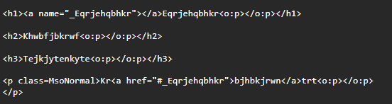
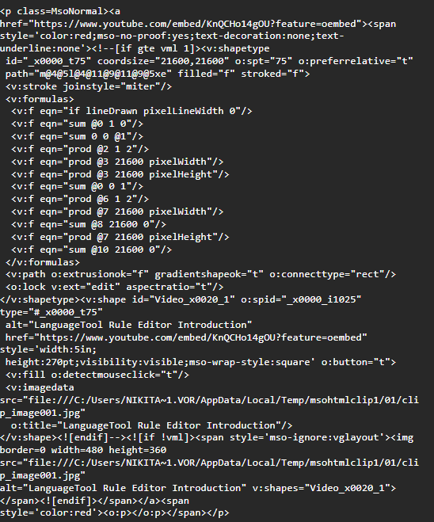
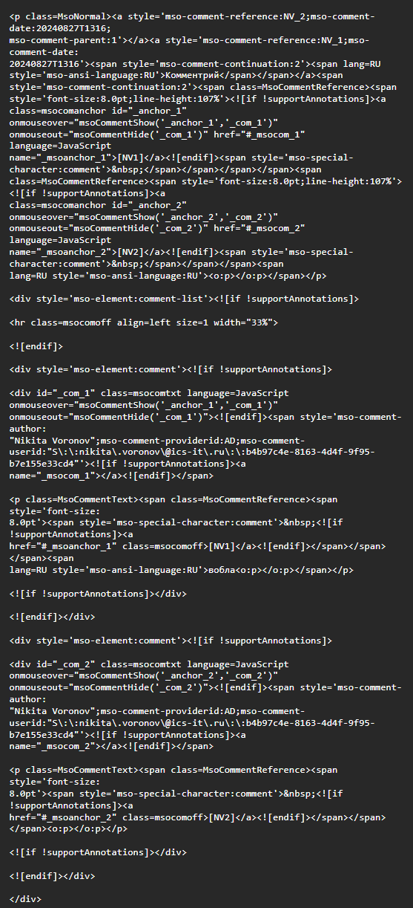
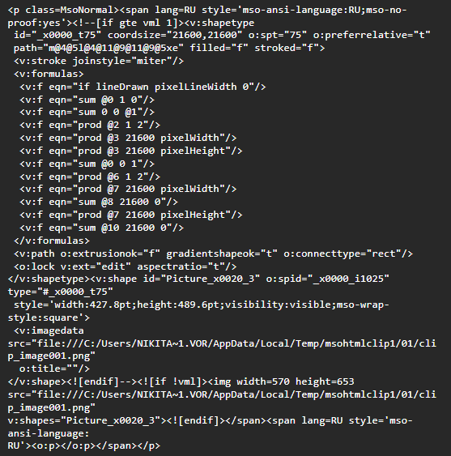
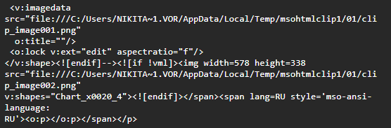
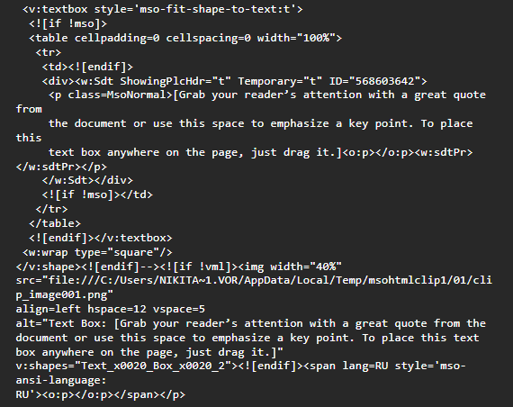



---

*  

   Компонент

*  

   Приходящий HTML

*  

   Выходящий HTML

*  

   Сложность переноса (1-10)

---

*  

   Цвет текста

*  

   `
ТЕКСТ<o:p></o:p>
`

*  

   `ТЕКСТ`

*  

   2

---

*  

   Списки

*  

   

*  

   `<ul><li>Тестовое тесто</>li … </ul>`

*  

   5

---

*  

   Ссылки

*  

   

*  

   Ссылка верная в HTML дереве, но хранится в markdown неверно, поэтому не работает.

   Что можно с этим сделать?

*  

   ?

---

*  

   Видео

*  

   

*  

   В модель видео добавить парсинг для html.

   MsO не поддерживает рутуб.

*  

   4

---

*  

   Комментарии

*  

   

*  

   Действовать так же, как обычно с добавлением комментариев.

*  

   5

---

*  

   Изображения

*  

   

*  

   Действовать так же, как при добавлении картинки из буфера

*  

   9

---

*  

   Графики

*  

   

*  

   Так же, как и с изображениями

*  

   9

---

*  

   Textbox

*  

   

*  

   Вставлять, как обычный текст

*  

   2


