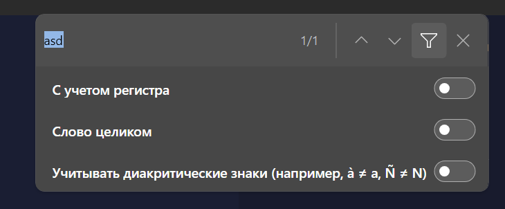
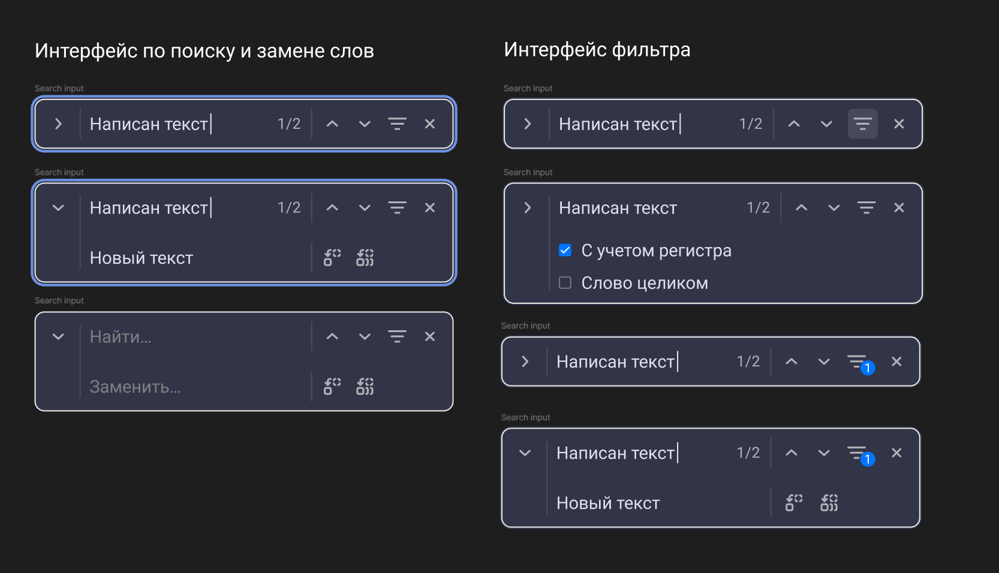

В десктопном приложении на macOS сейчас нет поиска по странице на `cmd`\+`F`.

Это неудобно для пользователей ([сообщение в чате](https://t.me/gramax_chat/603)). Надо добавить.

### Референс

-  Confluence;

-  vs Code;

-  Google Chrome.

:::info:true Vs Code 

[image:./poisk-po-stranice-v-desktopnom-prilozhenii-na-mac-7.png::схлопнутый :0,0,100,100:93:]

[image:./poisk-po-stranice-v-desktopnom-prilozhenii-na-mac-3.png::развернутый:0,0,100,100:92:]

:::

:::info:true Дефолтный поиск на windows в tauri

:::

:::info:true Поиск в Confluence

[image:./poisk-po-stranice-v-desktopnom-prilozhenii-na-mac-2.png:::0,0,100,100:square,58.2545,23.6578,3.12989,8.36497,,top-left]

:::

## Дизайн

:::info:true Дизайн макет поиска

:::

## Критерии

1. При нажатии `cmd`\+`F` открывается окно поиска в правом верхнем углу экрана:

   1. Если выделен текст в статье, тогда по нему сразу производиться поиск;

   2. Если переключить статью или закрыть поиск, текст в поиске сохраняется.

2. Поиск работает только по тексту статьи и не затрагивает другие элементы интерфейса;

3. Окно поиска включает в себя:

   -  **Найти**: Справа от инпута находится счетчик совпадений;

   -  **Заменить**: Поле для ввода текста, который будет заменять найденные результаты;

   -  **Фильтр**: Два чек-бокса для выбора типа поиска;

   -  **Закрыть**: Сворачивает окно поиска;

   -  **Скролл вверх** (`↑`): Переходит к предыдущему результату поиска и скролит до него;

   -  **Скролл вниз** (`↓`): Переходит к следующему результату поиска и скроллит до него;

   -  **Заменить**: Заменяет активное совпадение (элемент) на текст из поля «Заменить»;

   -  **Заменить все**: Заменяет все совпадения (элементы) на текст из поля «Заменить».

4. Совпадения в поиске будут выделены желтым;

5. Горячие клавиши поиска:

   -  Когда фокус в инпуте по нажатию `Esc`:

      -  Сворачивает окно поиска.

   -  Переходит к предыдущему результату поиска:

      -  **Стрелка вверх**;

      -  **Shift-Enter**.

   -  Переходит к следующему результату поиска:

      -  **Стрелка вниз**;

      -  **Enter**.

   -  По достижении последнего результата поиск начинается сначала. Это также работает при обратном поиске.

## Оценка

-  анализ: 6 ч.

-  реализация 34 ч. + 6ч