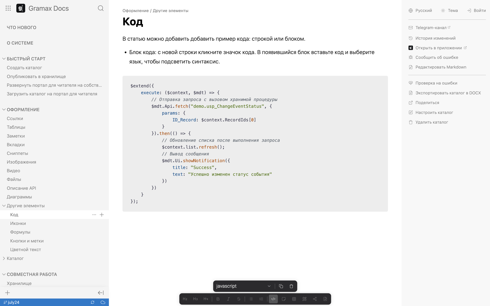

В статью можно добавить добавить пример кода: блоком или строкой.

-  Блок кода: с новой строки кликните значок кода. В появившийся блок вставьте код и выберите язык, чтобы подсветить синтаксис.

   

-  Строка кода: выделите строку и в дополнительной панели кликните значок кода.

   [image:./code-2.png:::0,0,100,23.2938:]