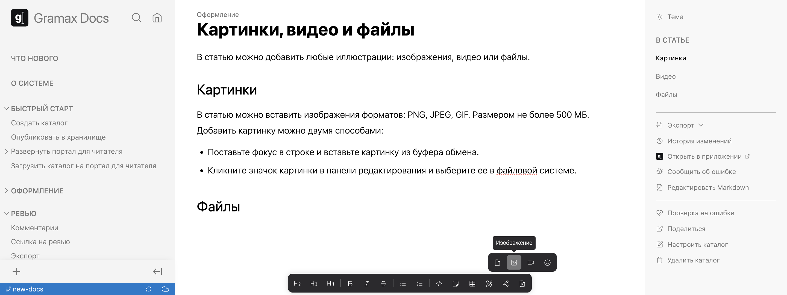

Доступные форматы изображений -- PNG, JPEG, GIF. Максимальный размер -- 500 МБ.

## Добавить

Добавить изображение в статью можно двумя способами:

-  Поставьте фокус в строке и вставьте картинку из буфера обмена.

-  Кликните значок картинки в панели редактирования и выберите ее в файловой системе.

## Отредактировать

Можно обрезать изображение или добавить аннотации. Для этого кликните на изображение, а затем в дополнительной панели нажмите *Редактировать*.

[image:./images-2.png:::0,0,100,100:annotation,58.1633,37.5371,Внешний вид подписи,top-left,&annotation,42.8564,88.2789,Поле для ввода подписи,bottom-right,&annotation,59.08801,84.715783,Иконка редактирования,bottom-left]