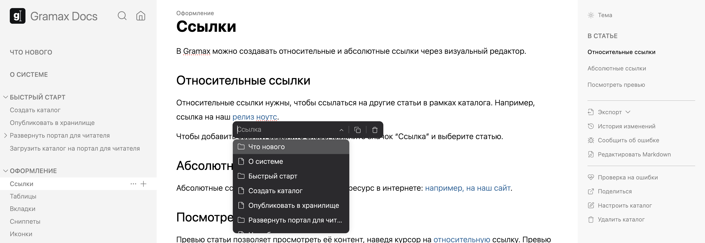
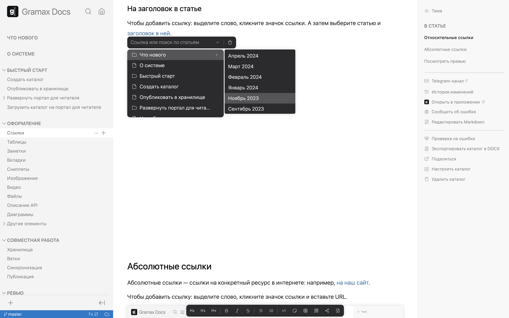
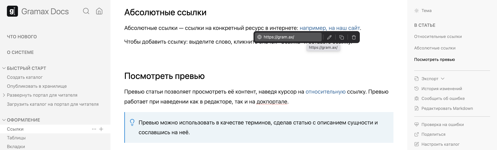

В Gramax можно создавать относительные и абсолютные ссылки через визуальный редактор.

## Относительные ссылки

Относительные ссылки нужны, чтобы ссылаться на другие статьи в рамках каталога. Например, ссылка на [релиз ноутс](./../../whats-new/_index). Относительные ссылки автоматически обновляются при перемещении статей в навигации и при изменении URL статьи.

### На статью

Чтобы добавить ссылку: выделите слово, кликните значок ссылки и выберите статью.

### На заголовок в статье

Чтобы добавить ссылку: выделите слово, кликните значок ссылки. А затем выберите статью и заголовок в ней.

При клике на ссылку статья откроется не с самого начала, а с этого заголовка.

## Абсолютные ссылки

Абсолютные ссылки -- ссылки на конкретный ресурс в интернете: например, [на наш сайт](https://gram.ax/).

Чтобы добавить ссылку: выделите слово, кликните значок ссылки и вставьте URL.

## Посмотреть превью

Превью статьи позволяет просмотреть её контент. Для этого наведите курсор на [относительную](./link-editor) ссылку. Превью работает при наведении как в редакторе, так и на портале для чтения.

:::tip 

Превью можно использовать в случаях, если нужно объяснить какой-то термин. Сделайте для него отдельную статью и добавьте на нее ссылку.

:::