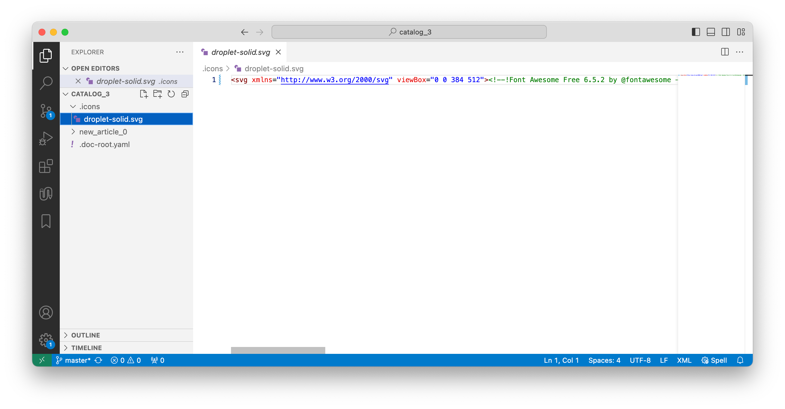

Вы можете добавлять в статьи иконки -- стандартные или собственные.

## Иконки Lucide

Если у вас нет собственных иконок, можете воспользоваться бесплатной [библиотекой Lucide](https://lucide.dev/icons/).

Чтобы добавить такую иконку в статью, кликните значок иконки в панели редактирования и выберите подходящую в выпадающем списке.

## Собственные иконки

Вы можете использовать в статьях собственные иконки.

1. Откройте репозиторий с каталогом в любом текстовом редакторе. Затем создайте папку `.icons/` рядом с файлом `.doc-root.yaml`.

2. Добавьте в папку SVG-файлы с иконками и опубликуйте их.

   

3. Откройте статью, в которой должна быть иконка из папки. Пропишите Markdown-код: `[icon:{code}]` , где `code` -- название SVG-файла иконки.