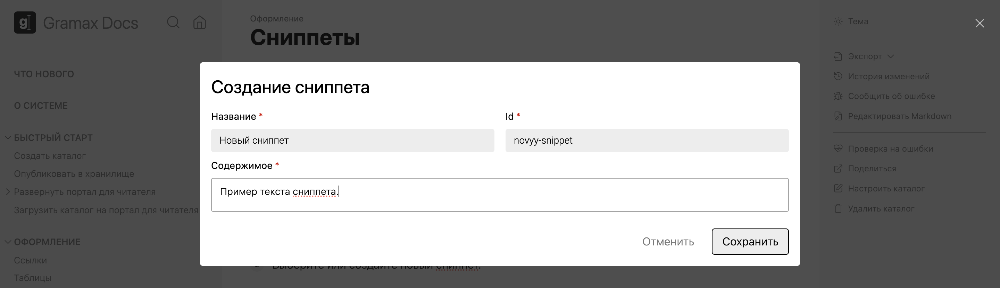
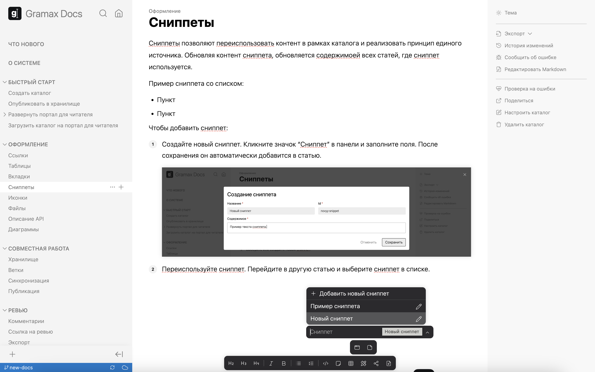

Сниппеты позволяют переиспользовать контент в рамках каталога и реализовать принцип единого источника. При обновлении контента сниппета обновляется содержимое всех статей, где он используется.

-  Сниппеты можно использовать только в рамках одного каталога.

-  Каждый сниппет -- отдельный файл в репозитории.

-  В сниппете можно просмотреть, в каких статьях он используется.

-  При удалении сниппета Gramax предупредит, из каких статей он также удалится.

Чтобы добавить сниппет, кликните значок сниппета в панели редактирования и заполните поля. После сохранения он автоматически добавится в статью.

Переиспользуйте сниппет. Перейдите в другую статью и выберите сниппет в списке.

