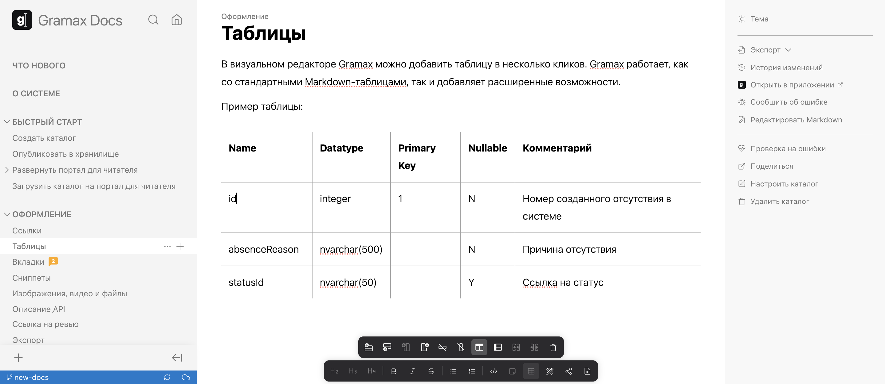

В визуальном редакторе Gramax можно добавить таблицу в несколько кликов. Gramax работает со стандартными Markdown-таблицами и добавляет расширенные возможности.

Пример таблицы:



---

*  

   Name

*  

   Datatype

*  

   Primary Key

*  

   Nullable

*  

   Комментарий

---

*  

   id

*  integer

*  1

*  N

*  Номер созданного отсутствия в системе

---

*  

   absenceReason

*  nvarchar(500)

*  

*  N

*  Причина отсутствия

---

*  

   statusId

*  nvarchar(50)

*  

*  Y

*  Ссылка на статус



Добавить таблицу можно двумя способами:

1. Создать вручную. Для этого кликните значок таблицы в панели редактирования, а затем оформите ее: добавьте строки и столбцы, определите заголовки, объедините ячейки.

   

2. Перенести из Excel. Крупные таблицы можно просто перенести из любой другой системы. Для этого достаточно скопировать таблицу и вставить в статью в Gramax.

:::note Закрепить markdown

Если важно, чтобы в статье таблицы были именно в разметке Markdown:

1. Не меняйте вручную ширину столбцов.

2. Не объединяйте ячейки в таблице.

Именно эти действия форматируют Markdown-таблицу в расширенный синтаксис.

:::