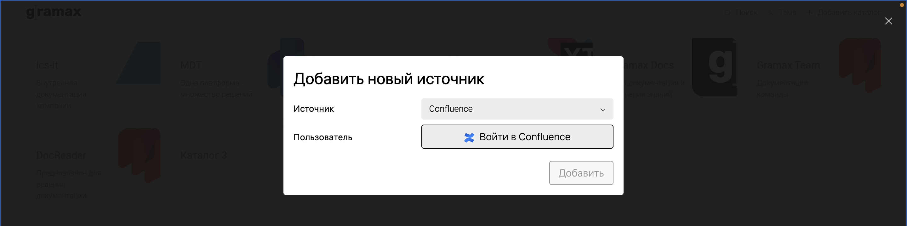

Вы можете перенести разделы из Confluence в Gramax, а затем опубликовать каталоги в свое Git-хранилище. Gramax конвертирует все известные элементы с высокой точностью и сохранением иерархии.

## Импортировать раздел

1. На главной нажмите *Добавить каталог*, а затем *Импортировать*. Добавьте аккаунт в Confluence в качестве источника.

   1. Для облачной версии Confluence -- войдите в аккаунт.

      

   2. Для серверной версии -- укажите ссылку на домен Confluence и [токен аккаунта](https://confluence.atlassian.com/enterprise/using-personal-access-tokens-1026032365.html).

      [image:./confluence-3.png:::0,0,100,55.7864:]

      :::info 

      Импорт разделов из серверной версии Confluence возможен только в десктопной версии Gramax.

      :::

2. Выберите раздел, который хотите перенести в Gramax. Нажмите *Импортировать* -- из раздела в Confluence создастся каталог в Gramax. Останется только [опубликовать](./../../collaboration/publish) его в хранилище.

## Проверить элементы

Gramax переносит только основные функции и элементы Confluence. Известные ограничения:

-  Gramax поддерживает перенос текста, заметок, таблиц и изображений. Остальные элементы, такие как фреймы, графики, задачи Jira, не будут перенесены -- вместо них останется заметка со ссылкой на оригинальную статью в Confluence.

-  Доски не переносятся, кроме случаев, когда под доской вложена статья.

-  Интеллектуальные ссылки и их дочерние страницы также не переносятся.

-  Черновики и несохраненные изменения не будут перенесены.

-  Остальные макросы Confluence пока не поддерживаются и не будут перенесены.

После переноса мы рекомендуем проверить каталог. Для этого в правой панели кликните *Проверка на ошибки* и просмотрите, какие элементы не перенеслись.

[image:./confluence-2.png:::0,0,100,61.7211:]