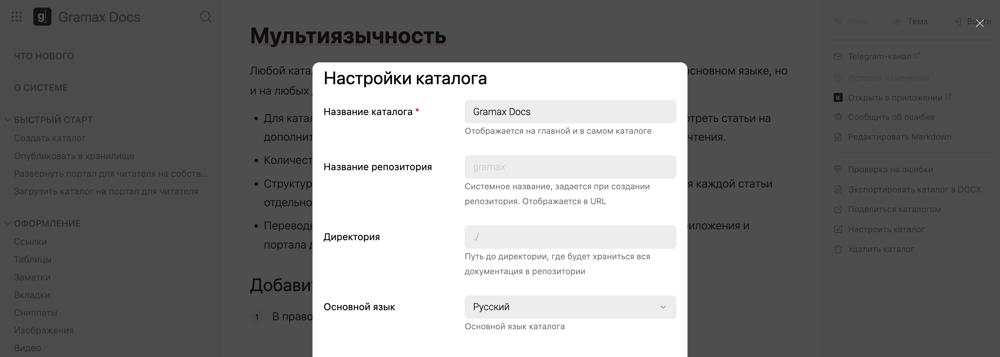
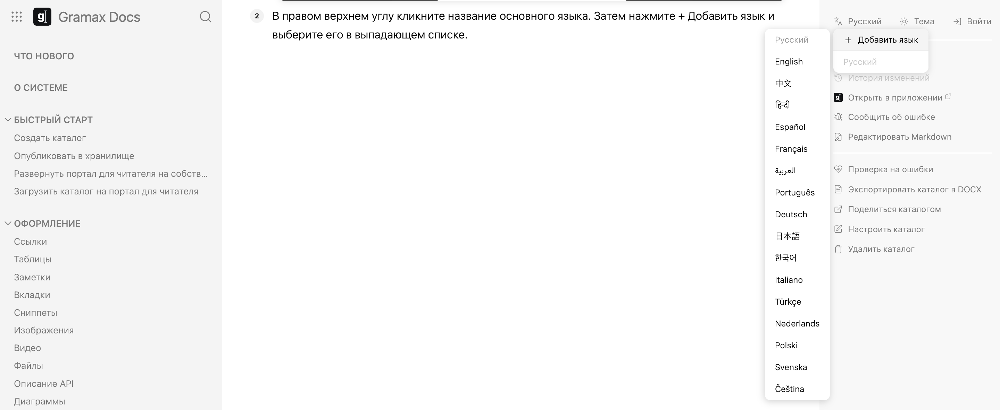
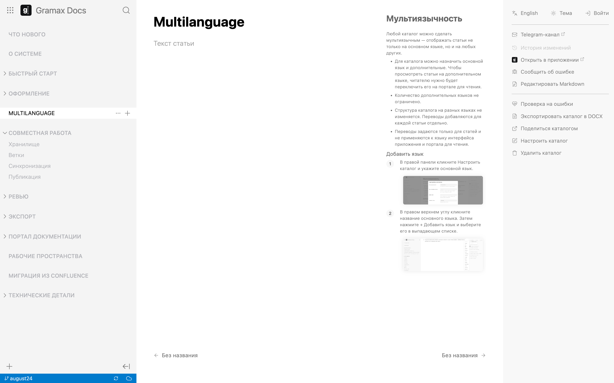

Любой каталог можно сделать мультиязычным -- отображать статьи не только на выбранном основном языке, но и на  других.

-  Для каталога можно назначить основной язык и дополнительные. Чтобы просмотреть статьи на дополнительном языке, читателю нужно будет переключить его на портале для чтения.

-  Доступны 17 популярных языков: Русский, Английский, Китайский, Хинди, Испанский, Французский, Арабский, Португальский, Немецкий, Японский, Корейский, Итальянский, Турецкий, Нидерландский, Польский, Шведский, Чешский.

-  Важно, что структура каталога на разных языках не изменяется. Переводы добавляются для каждой статьи отдельно.

-  Переводы задаются только для статей и не применяются к языку интерфейса приложения и портала для чтения.

## Добавить язык

1. В правой панели кликните *Настроить каталог* и укажите основной язык.

   

   :::info 

   Основной язык можно указать единожды в *Настроить каталог*. Изменить его можно только в [файле конфигурации каталога](./setting/doc-root-yaml).

   :::

2. В правом верхнем углу кликните название основного языка. Затем нажмите *\+ Добавить язык* и выберите его в выпадающем списке.

   

## Перевести статьи

1. Переключитесь в приложении на дополнительный язык.

2. Откройте статью для перевода. В правой части будет отображаться ее версия на основном языке. Введите текст статьи на дополнительном языке.

Если для статьи еще нет перевода, в левой навигации ее заголовок будет бледным, на портале для чтения она не отобразится. Статья с переводом отобразится как обычно.

## Опубликовать перевод

Опубликуйте переведенные статьи [стандартным способом](./../collaboration/publish).

В хранилище переводы будут находиться в отдельной папке с постфиксом дополнительного языка.