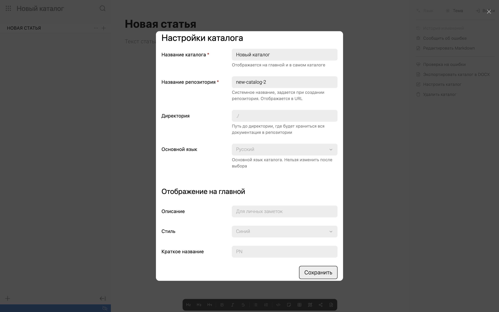

Параметры каталога хранятся в репозитории в [файле .doc-root.yaml](./doc-root-yaml). При любом изменении их нужно опубликовать [стандартным образом](./../../collaboration/publish).

-  **Название каталога** -- отображается на главной и в левом углу над навигацией.

-  **Название репозитория** -- отображается в cсылках и в Git-хранилище. После публикации нового каталога в хранилище этот параметр изменить нельзя. Если каталог загружен из хранилища -- параметр также заблокирован для изменения.

-  **Директория** -- папка в репозитории, в которой будут находиться статьи. Если не заполнять, папка со статьями добавится в корень репозитория.

-  **Основной язык** -- указывается, если для каталога будут добавлены [версии на других языках](./../multilanguage).

-  **Отображение на главной** -- настройки стилей для плашки с каталогом на главной.

