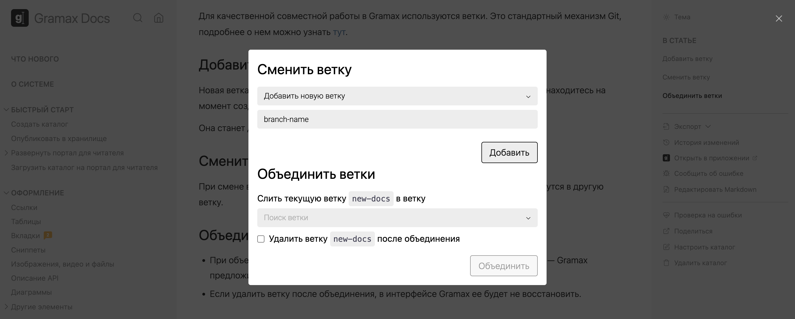
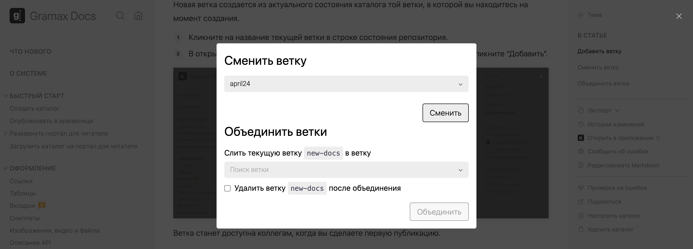
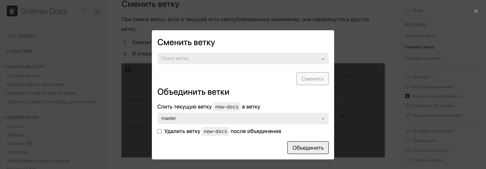

Работа через ветки позволяет вам создавать независимые локальные версии каталога. Вы можете свободно вносить изменения в локальных версиях, а потом опубликовать их для коллег и объединить с другими ветками в каталоге.

-  В интерфейсе приложения можно создавать ветки (branch), переключаться между ними (switch), объединять (merge) и удалять.

-  На портале документации отображается только одна основная ветка. Изменения из других веток недоступны для читателей.

-  Удобнее всего каждое изменение вносить в изолированной ветке. А после согласования -- объединять ее с основной.

## Добавить ветку

Новая ветка создается из актуального состояния каталога той ветки, в которой вы находитесь на момент создания.

Для этого кликните на название текущей ветки [icon:git-branch] в строке состояния репозитория. В открывшемся окне добавьте новую ветку.

Ветка станет доступна коллегам, когда вы сделаете первую [публикацию](./publish).

## Сменить ветку

Чтобы сменить ветку, в окне управления ветками выберите ту, на которую хотите переключиться.

:::note Перенос изменений при смене ветки

Если у вас есть неопубликованные изменения в текущей ветке, они автоматически переместятся при переключении на другую ветку. Если вы вернетесь обратно в исходную ветку, эти изменения исчезнут из той ветки, на которую вы переключились.

Чтобы избежать автоматического перемещения изменений между ветками, [опубликуйте](./publish) их перед переключением.

:::

## Объединить ветки

Чтобы объединить ветки, выберите ту, в которую хотите опубликовать изменения из текущей ветки. Затем нажмите *Объединить*.

При объединении веток изменения из них «сливаются». Но если есть конфликтующие изменения -- Gramax предложит их решить.

:::note Удаление ветки после объединения

Если удалить ветку после объединения, в интерфейсе Gramax ее нельзя будет восстановить.

:::