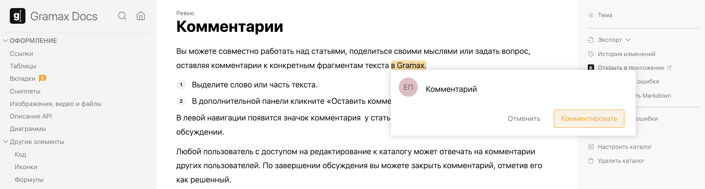

Вы можете совместно работать над статьями, поделиться своими мыслями или задать вопрос, оставляя комментарии к конкретным фрагментам текста в Gramax.

Чтобы оставить комментарий, выделите слово или часть текста. Затем в дополнительной панели кликните *Оставить комментарий* и введите текст.

В левой навигации появится значок комментария  у статьи, с указанием количества комментариев в обсуждении.

Любой пользователь с доступом на редактирование к каталогу может отвечать на комментарии других пользователей. По завершении обсуждения вы можете закрыть комментарий, отметив его как решенный.