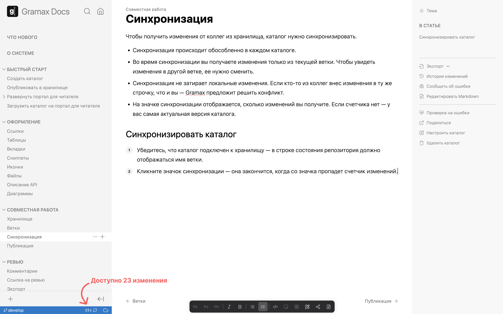
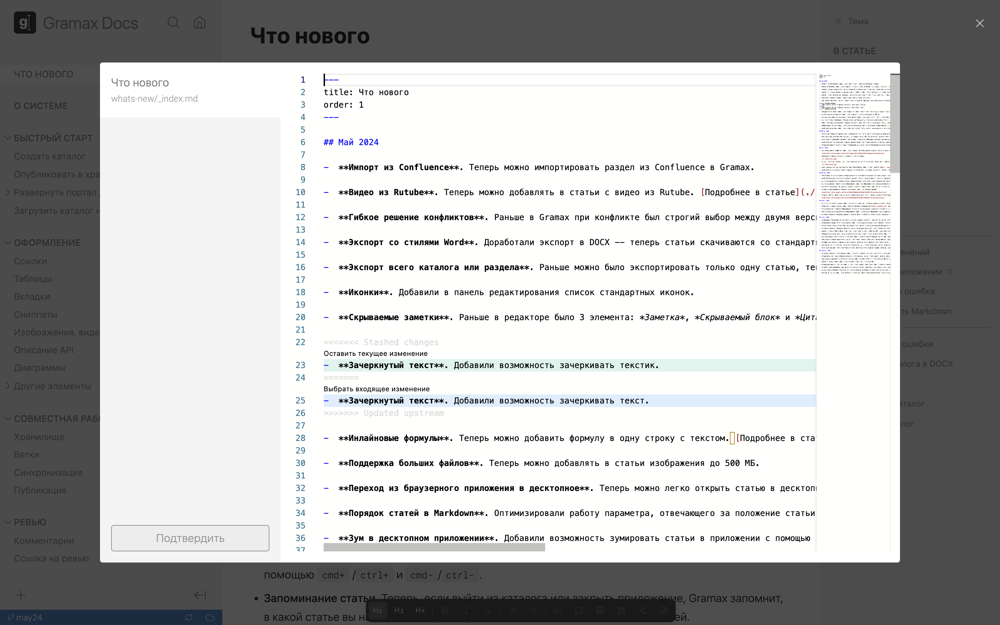

Чтобы получить изменения от коллег из хранилища, каталог нужно синхронизировать.

-  Синхронизация (pull) происходит обособленно в каждом каталоге.

-  Во время синхронизации вы получаете изменения только из текущей ветки. Чтобы увидеть изменения в другой ветке, ее нужно сменить.

-  Синхронизация не затирает локальные изменения. Если кто-то из коллег внес изменения в ту же строчку, что и вы -- Gramax предложит решить конфликт.

-  На значке синхронизации отображается, сколько изменений вы получите. Если счетчика нет -- у вас самая актуальная версия каталога.

## Синхронизировать каталог

Убедитесь, что каталог подключен к хранилищу -- в строке состояния репозитория должно отображаться имя ветки. Кликните значок синхронизации -- она закончится, когда со значка пропадет счетчик изменений.

## Решить конфликт

При синхронизации может произойти конфликт -- это значит, что кто-то из коллег изменил ту строчку, которая у вас так же изменена локально.

1. Кликните *Решить конфликт* -- откроется окно с входящими и локальными изменениями.

2. Решите конфликт. Gramax не ограничивает в способах:

   -  Выберите одну из версий.

   -  Сотрите обе версии.

   -  Оставьте обе версии.

   

3. Кликните *Подтвердить* -- файл сохранится локально. При публикации в хранилище именно эта версия будет считаться актуальной.