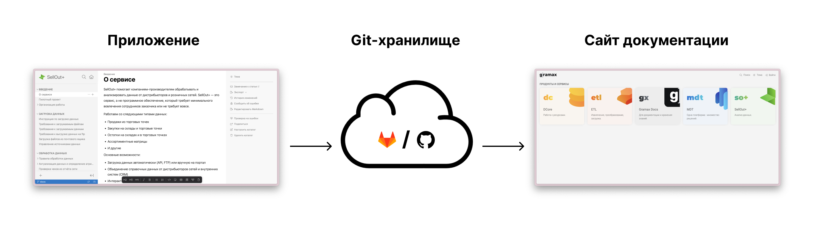

Gramax -- это **бесплатное** приложение с открытым исходным кодом для создания, редактирования и публикации документации. Gramax чаще всего используется как:

-  Портал документации о продукте.

-  Внутренняя база знаний.

-  Проектная документация.

-  Персональные заметки.

## Начало работы

1. [Создать каталог](./create-catalog).

2. [Опубликовать каталог в хранилище](./publish-repository).

3. [Развернуть портал для читателя](./own-server/_index).

4. [Загрузить каталог на созданный портал](./clone-catalog/_index).

## Компоненты

1. Приложение Gramax. В нем пользователи создают [каталоги](./../catalog/_index) и редактируют [статьи](./../article/_index). Есть браузерная и десктопная версия для Windows, Mac, Linux.

2. [Хранилище](./../storage/_index). С его помощью происходит синхронизация каталогов между пользователями. А также из хранилища информация публикуется на портал документации.

3. [Портал документации](./../doc-portal/_index). Это сайт, на котором читатели просматривают документацию.

