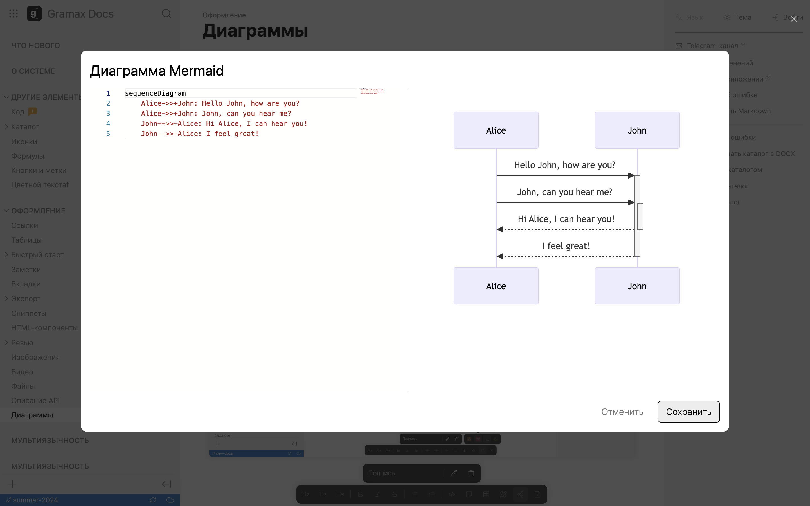
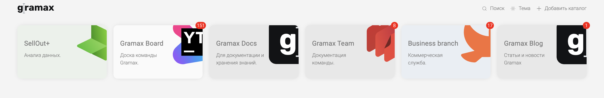
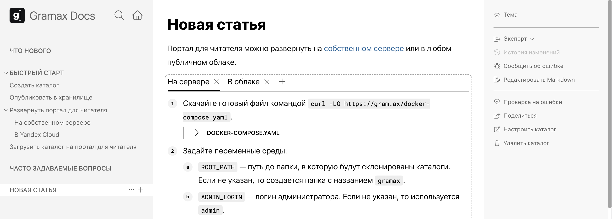
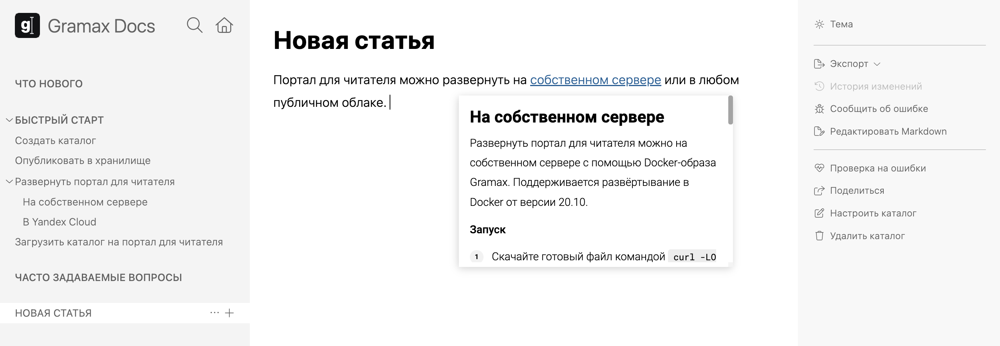

## Сентябрь 2024

-  **Поиск по тексту статьи**. Добавили поиск по статье. Он открывается по клику `cmd`/`ctrl` + `F`.

-  **Перенос контента из MS Word**. Можно скопировать текст из файла MS Word и перенести его со всем оформлением и вложениями в Gramax. Известное ограничение: картинки, диаграммы и другие вложения переносятся только в десктопной версии Gramax.

-  **Экспорт статей и разделов с портала для чтения**. Теперь на портале для чтения можно экспортировать статьи и разделы, как в приложении.

   [image:./whats-new-4.png:::0,0,100,32.6409:]

-  **Предпросмотр в окне редактирования диаграммы**. Можно в режиме реального времени просматривать результат редактирования.

   

-  **Автоматическая индексация статей на портале для чтения**. Теперь все новые статьи автоматически добавляются в sitemap.xml для индексации в поисковых системах. Позже добавим возможность использовать свой robot.txt и ограничивать индексацию параметром при публикации.

-  **Переход по ссылке в десктопное приложение**. Раньше все ссылки открывались только в браузерной версии. Теперь Gramax откроет ссылку в десктопном приложении, если оно установлено (от версии 2024.10.1.11) и запущено.

-  **Импорт из серверной версии Confluence.** Добавили возможность импортировать разделы не только из облачного Confluence, но и из серверного. Подробнее [в статье](./../catalog/migration/confluence).

-  **Ускорение работы**. На 50% ускорили загрузку главной страницы и списка репозиториев.

-  **Сохранение размера окна Gramax после перезапуска**. После обновления или перезагрузки десктопное приложение Gramax открывается с тем размером окна, который вы задали.

-  **Уменьшение количества ложных срабатываний антивирусов**. Сделали подпись авторизованного разработчика Windows, чтобы антивирусы не блокировали работу.

-  **Ограничения для HTML-компонентов**. Добавили ограничение, которое не позволяет HTML-компоненту влиять на внешний вид Gramax. Как снять ограничение читайте[ в статье](./../article/editor/other-elements/html-component).

-  **Проверка ссылок на заголовки**. В проверке на ошибки можно увидеть, где указана относительная ссылка на несуществующий заголовок. Это полезно в случае, если заголовок изменился, а ссылка ведет на старый -- несуществующий.

-  **Поддержка Pascal и PowerShell в блоке кода**. Расширили список поддерживаемых языков в блоке кода: добавили Pascal и PowerShell.

-  **Улучшение фокуса на изображения и диаграммы**. В новой версии улучшили работу с изображениями и диаграммами. Также исправили некоторые проблемы: например, теперь можно поставить фокус между двумя изображениями.

## Август 2024

-  **Механизм мультиязычности** [beta]. Добавили возможность сделать каталог на разных языках. [Подробнее в статье](./../catalog/multilanguage).

-  **HTML-компоненты в статье**. В новой версии можно добавить в статью любой кастомный HTML-элемент: например, подвал для статей, страничку с сайта, форму обратной связи. [Подробнее в статье](./../article/editor/other-elements/html-component).

-  **Перетаскивание элементов в статье**. Раньше можно было перемещать текст, изображения, заметки и другие элементы оформления только с помощью горячих клавиш. Теперь это доступно и с помощью мыши.

-  **Поддержка HTML, cURL и 1C в блоке кода**. Расширили список поддерживаемых языков в блоке кода: добавили HTML, cURL и 1C.

-  **Стабилизация перетаскивания статей**. Раньше при перетаскивании статей ломались относительные ссылки, теперь такого не происходит. Также в новой версии ускорили само перетаскивание и добавили удобную прокрутку навигации.

-  **Удобный просмотр картинок и диаграмм**. Доработали интерфейс полноэкранного просмотра картинок и диаграмм: теперь в нем можно приблизить, передвинуть, скачать изображение и открыть его для редактирования. Также сильно улучшили внешний вид и исправили много проблем.

-  **Изменение размера картинки**. Добавили возможность изменить размер картинки в статье.

-  **Отображение переносов в истории изменений**. Теперь в истории изменений можно посмотреть, куда переносилась статьи и как менялся ее URL.

-  **Перенос файлов в корзину в десктопной версии**. Раньше при удалении статьи или картинки в десктопной версии файл навсегда удалялся. Теперь он переносится в корзину.

-  **Проверка ссылок на заголовки**. В проверке на ошибки отображаются ссылки, которые ведут на некорректный заголовок.

-  **Уведомление о неудачной отправке отчета об ошибке**. Возможность отправить отчет об ошибке доступна только в том случае, если в браузере не включен блокировщик рекламы. Если он включен -- Gramax уведомит, что отчет не удалось отправить.

-  **Корректный экспорт таблиц в DOCX для Libre Office**. Экспортированные статьи с таблицами корректно отображаются в Libre Office.

-  **Другие улучшения элементов интерфейса**. Теперь все скругления одинаковые и красивые, сделали более понятным окно *Поделиться ссылкой*, а также улучшили взаимодействие с выпадающими списками.

## Июль 2024

-  **Универсальное Git-хранилище**. Теперь в качестве хранилища можно подключать не только GitLab и GitHub, но и Bitbucket, Gitea, Gogs, GitVerse. Со временем этот список будем расширять.

-  **API портала документации**. Добавился REST API на получение навигации, статей и ресурсов. Теперь вы можете встроить инструкции с портала документации в любую другую систему: например, на сайт или в интерфейс своего продукта. [Подробнее в статье](./../doc-portal/api).

-  **Ссылки на заголовки внутри статьи**. Раньше можно было ссылаться только на другие статьи. В новой версии появилась возможность сделать ссылку на заголовок в текущей статье. Например, чтобы сформировать оглавление.

-  **Превью заголовка**. Если ссылка ведет на конкретный заголовок в статье, в превью она также покажется с этого заголовка, а не с самого начала.

-  **Улучшения блока кода**. Теперь язык для блока кода можно выбрать в выпадающем меню. Подсветка синтаксиса отображается не только на портале документации, но и в приложении. [Подробнее в статье](./../article/editor/code).

-  **Подключение Яндекс Метрики на портал документации**. Появилась возможность просматривать статистику, кто и как читает статьи: для этого необходимо подключить к порталу Яндекс Метрику. [Подробнее в статье](./../doc-portal/yandex-metrics).

-  **Индексация в поисковых системах**. Для статей можно настроить индексацию в поисковых системах, чтобы клиентам было проще находить инструкции или справочные материалы. ***UPD**: с сентября 2024 все статьи индексируются автоматически.*

-  **Gramax на английском**. В новой версии можно переключить язык интерфейса на английский.

   [image:./whats-new-2.png:::0,0,100,21.2166:square,82.0943,7.33215,7.37328,60.6622,Переключение языка интерфейса,top-left]

-  **Проверка ошибок в синтаксисе Mermaid-диаграмм**. Gramax проверит, почему не отобразилась диаграмма. А также укажет, в какой строке ошибка.

-  **Сортировка каталогов на главной**. Сделали возможность задавать параметр `order` для каталога. По нему будет определяться, в каком порядке каталоги расположены на главной. Если параметр не указан, сортируются по алфавиту. [Подробнее в статье](./../catalog/setting/doc-root-yaml).

-  **Проверка на ошибки после импорта из Confluence**. Так как при импорте переносятся не все элементы, мы настроили проверку на такие элементы. [Подробнее в статье](./../catalog/migration/confluence).

## Июнь 2024

-  **Рабочие пространства**. Теперь можно создать несколько пространств для работы: например, разделить личные каталоги и рабочие. В десктопной версии это будут отдельные папки в файловой системе компьютера. [Подробнее в статье](./../workspace).

-  **Редактор изображений**. Теперь прямо в интерфейсе Gramax можно отредактировать изображение: обрезать, добавить аннотацию или обводку. [Подробнее в статье](./../article/editor/pictures).

-  **Уведомления на главной**. На главной странице можно посмотреть, сколько изменений доступно для синхронизации в каждом каталоге.

   

-  **Ссылки на заголовки**. В относительных ссылках появилась возможность выбрать заголовок. При клике на ссылку статья откроется не с самого начала, а с этого заголовка. [Подробнее в статье](./../article/editor/link-editor).

-  **Гибкое решение конфликтов**. Расширили список поддерживаемых конфликтов. Теперь в интерфейсе можно просмотреть и решить конфликты с переименованием, добавлением, удалением файлов.

-  **Новый вид заметок**. Улучшили внешний вид заметок: добавили новые цвета, тултипы и возможность писать заголовок в любом регистре.

   :::note Проверьте заголовки в заметках!

   Если заголовок был написан строчными буквами, теперь он будет отображаться строчными, а не заглавными.

   :::

-  **Улучшение импорта из Confluence**.

   -  Расширили список импортируемых элементов.

   -  Добавили проверку перед импортом: она покажет, какие элементы не перенесутся.

-  **Улучшение таблиц**. В новой версии убрали некоторые ограничения при работе с таблицами.

   -  Новый столбец и новую строку можно добавить в любом месте таблицы.

   -  Можно развернуть таблицу на всю ширину окна -- достаточно просто скрыть боковые панели.

   -  Markdown-таблицы добавляются в исходный файл в читаемом виде.

-  **Комментарии на текст с оформлением**. Добавили возможность комментировать в том числе с оформлением: жирный, курсив, зачеркнутый.

-  **Автоматическая синхронизация каталога**. Теперь после перехода по ссылке, если в каталоге нет неопубликованных изменений, каталог автоматически синхронизируется. Это очень удобно.

-  **Поиск в выпадающих списках в неправильной раскладке и транслитерации**. Gramax поймет, если вы ввели текст в неправильной раскладке или, например, латиницей вместо кириллицы.

## Май 2024

-  **Импорт из Confluence** [beta]. Теперь можно импортировать раздел из Confluence в Gramax. [Подробнее в статье](./../catalog/migration/confluence).

-  **Улучшения копирования и вставки**. Можно скопировать контент статьи вместе с изображениями, диаграммами и другими файлами -- при вставке они также перенесутся.

-  **Зум в десктопном приложении**. Добавили возможность приближать и отдалять статьи в приложении с помощью [kbd:cmd+] /[kbd:ctrl+] и [kbd:cmd-]/[kbd:ctrl-].

-  **Порядок статей в Markdown**. При перетаскивании статьи в навигации в списке изменений не будет отображаться изменение порядка статей во всем разделе.

-  **Переход из браузерного приложения в десктопное**. Можно легко открыть статью в десктопном приложении -- достаточно в браузерном нажать в правой панели *Открыть в приложении*.

-  **Запоминание статьи**. Теперь, если выйти из каталога или закрыть приложение, Gramax запомнит, в какой статье вы находились. При открытии каталога вы снова окажетесь в ней.

-  **Гибкое решение конфликтов**. Раньше в Gramax при конфликте был строгий выбор между двумя версиями. Теперь можно выбрать одну версию, оставить или удалить обе. [Подробнее в статье](./../collaboration/sync).

-  **Экспорт всего каталога или раздела в** **DOCX** [beta]. Сделали возможность скачать не только одну статью, но и весь каталог или отдельный раздел. [Подробнее в статье](./../collaboration/export-docx-pdf).

-  **Иконки**. Добавили в панель редактирования список иконок.

-  **Скрываемые заметки**. Раньше в редакторе было 3 элемента: *Заметка*, *Скрываемый блок* и *Цитата*. Теперь это один элемент -- любую заметку можно сделать скрытой или оформить цитатой. [Подробнее в статье](./../article/editor/notes).

-  **Зачеркнутый текст**. Добавили возможность зачеркивать текст.

-  **Инлайновые формулы**. Теперь можно добавить формулу в одну строку с текстом. [Подробнее в статье.](./../article/editor/other-elements/formula)

-  **Видео из Rutube**. Добавили возможность отображать в статьях с видео из Rutube. [Подробнее в статье](./../article/editor/video).

-  **Поддержка больших файлов**. Увеличили допустимый размер изображений до 500 МБ.

## Апрель 2024

-  **Новый сайт Gramax.** Добавили видео и описание быстрого старта работы в приложении на [gram.ax](https://gram.ax).

-  **Автоматическая генерация URL статьи**. При создании статьи, URL  автоматически транслитерируется из заголовка, но позже его можно изменить.

-  **Ускорение и стабилизация операций с Git.** Теперь смена ветки, публикация изменений, загрузка каталогов и другие операции с Git в браузерной версии выполняются быстрее и стабильнее.

-  **Улучшение настроек каталога**. Добавили описания полей в настройках каталога и ограничили редактирование полей, которые нельзя менять после публикации каталога.

-  **Добавление пакетов иконок и отказ от Fontawesome.** Перешли с иконок Fontawesome на иконки [Lucide](https://lucide.dev/icons/). Чтобы сохранить иконки Fontawesome в статьях, воспользуйтесь [инструкцией](./../article/editor/other-elements/icons) по добавлению собственных пакетов иконок.

## Март 2024

-  **Переиспользуемые сниппеты**. Теперь можно создавать переиспользуемые фрагменты текста, а затем добавлять их в статьи по принципу единого источника.

   [video:https://drive.google.com/file/d/1_qgesec_QUC_YuRUvWxlbtDKrqivSgyq/view?usp=sharing:]

-  **Вкладки**. Добавили возможность создавать в статьях вкладки.

   

-  **Превью статьи на ссылке**. Превью статьи позволяет просмотреть её контент, наведя курсор на относительную ссылку в каталоге. Превью работает при наведении как в редакторе, так и на портале документации.

   

-  **Настраиваемый интервал обновления портала документации**. Теперь в [настройках портала](./../quick-start/own-server/_index) можно указать интервал автообновления. По умолчанию -- раз в 3 минуты.

-  **Улучшение формы обратной связи**. Добавили в форму «Сообщить об ошибке» возможность отправить технические детали. Это может нам лучше понимать и решать проблемы.

## Февраль 2024

-  **Десктопная версия для Linux**. Сделали бета-версию десктопного приложения для Linux. Скачать можно на [gram.ax](https://gram.ax/).

-  **Улучшенный поиск**. В новой версии поиск работает с учетом транслитерации и с текстом в неправильной раскладке клавиатуры.

-  **Проверка названия при создании ветки**. Gramax подскажет, если ветка с таким названием уже существует. А также, если название не соответствует требованиям Git.

-  **Проверка названия репозитория при публикации**. Теперь при публикации нового каталога Gramax проверяет, нет ли такого репозитория в хранилище.

-  **Переход в приложение с портала для чтения**. Перейти к редактированию теперь проще -- достаточно кликнуть “Редактировать в приложении” на портале для чтения -- откроется браузерное приложение и каталог автоматически загрузится.

-  **Редактирование OpenAPI.** Добавили в приложение редактор для описания OpenAPI.

   [video:https://drive.google.com/file/d/1DeKi559wgO0wrmbJlEFmqJrzGWiVhrCR/view?usp=drive_link:]

-  **Работа с пустым репозиторием.** Раньше в Gramax нельзя было открыть репозиторий без системных файлов. Теперь такого ограничения нет -- можно открывать любые репозитории.

   [video:https://drive.google.com/file/d/1UzRoNFnBk6jPTG5T4gZ_Y7mFbwoh6_5F/view?usp=sharing:]

## Январь 2024

-  **Простое открытие по ссылке**. Теперь можно просто скопировать ссылку из браузера и кому-то отправить. При переходе по ссылке откроется именно эта статья в этом каталоге и ветке. Если каталог не был загружен -- он загрузится, а если ветка не синхронизирована -- Gramax предложит ее синхронизировать. По-прежнему важно, что был доступ к чтению каталога.

-  **Диаграммы в офлайн-режиме**. Теперь диаграммы Mermaid и [Diagrams.net](https://Diagrams.net) работают полностью локально, без подключения к интернету. Для PlantUML все еще нужен интернет -- эти диаграммы формируются через публичный сервис [PlantUML.com](https://plantuml.com).

-  **Отображение иллюстраций при публикации**. В новой версии изображения и диаграммы отображаются в окне публикации изменений.

-  **Автокомментарий об изменениях при публикации**. Теперь комментарий к публикации можно не заполнять вручную -- по умолчанию пропишется, сколько и какие конкретно файлы были изменены. Если нужно этот комментарий можно изменить.

-  **Решение конфликта с удалением файла**. Решили проблемы с конфликтом, когда вносились изменения в статью, которую кто-то удалил. Теперь такие конфликты решаются стандартно.

## Ноябрь 2023

-  **Публикация документации на собственном сервере**. Сделали возможность развернуть портал для читателей на собственном сервере. Подробности в статье [Быстрый старт](./../quick-start/_index).

-  **Объединение (merge) веток в интерфейсе**. Теперь в интерфейсе приложения можно объединять ветки и удалять их после объединения.

-  **Многооконный режим**. В десктопном приложении можно работать в нескольких каталогах параллельно -- достаточно открыть каждый из них в новом окне.

-  **Решение конфликта с удаленным файлом**. Раньше в приложении нельзя было решить конфликт при синхронизации, когда вы внесли изменения в файл, который был удален на сервере. Теперь такая возможность появилась.

-  **Экспорт статей в DOCX и PDF**. Любую статью можно экспортировать в DOCX или PDF. Позже такая возможность появится для каталога целиком.

-  **Инлайновые комментарии**. Раньше комментарий можно было оставить только на блок текста. Теперь -- к конкретным фрагментам текста.

-  **Переименование ресурсов вместе со статьей**. Теперь, когда вы меняете название статьи в URL, также меняются названия всех зависимых ресурсов: картинок, диаграмм, загруженных файлов. Это нужно для того, чтобы лучше понимать, к какой статье относится ресурс.

-  **Упрощенное создание каталогов**. Раньше, чтобы создать каталог, нужно было сначала заполнить информацию о нем. Теперь каталог создается пустым, всю информацию можно заполнить позже.

-  **Группировка элементов в панели форматирования**. Навели порядок в панели форматирования текста, чтобы было проще ориентироваться в элементах.

-  **Ссылка на ревью до статьи**. Раньше, при отправке на ревью, ссылка отправлялась на весь каталог и открывалась самая первая статья. Теперь будет открываться статья, из которой эта ссылка отправлена.

-  **Ускорение операций с Git в десктопной версии**. Значительно ускорили синхронизацию каталога, смену ветки и загрузку истории изменения.

## Сентябрь 2023

-  **Решение конфликтов в интерфейсе**. Теперь, если есть конфликт, его можно решить прямо в интерфейсе Gramax.

-  **Добавление, настройка и удаление каталогов в интерфейсе**. Раньше, чтобы добавить каталог, нужно было создавать репозиторий и наполнять его системными файлами. Теперь это можно сделать в интерфейсе приложения. Также можно изменить параметры каталога: приватность, название, стиль и так далее.

-  **Упрощенное добавление относительных ссылок**. Теперь не нужно мучаться с относительными путями -- достаточно выбрать статью в выпадающем списке, путь проставится автоматически.

-  **Экспорт статей в PDF**. Теперь можно выгрузить любую статью в формате PDF.

-  **Добавление файлов в статью**. Теперь в статью можно добавить файл любого типа. По клику он скачается на компьютер.

-  **Редактирование Markdown**. Так как не все возможности у нас реализованы в интерфейсе, можно в правой панели открыть окно редактирования исходника статьи.

-  **Подключение к GitHub**. Если у вас есть личные каталоги на GitHub, их также можно просматривать в приложении. Достаточно подключить это хранилище.

-  **Ссылка на ревью**. Теперь можно поделиться ссылкой на редактирование каталога даже с теми, у кого нет доступа к репозиторию. Проверяющий будет вносить исправления и комментарии под данными редактора.